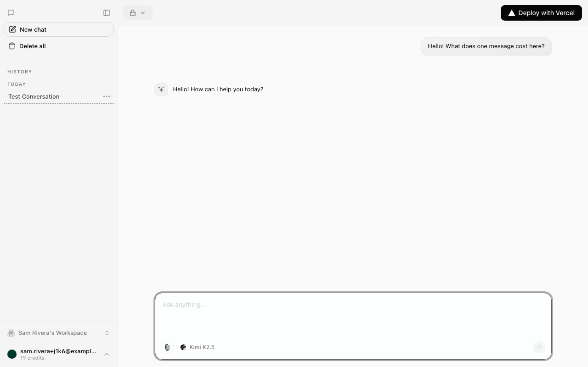
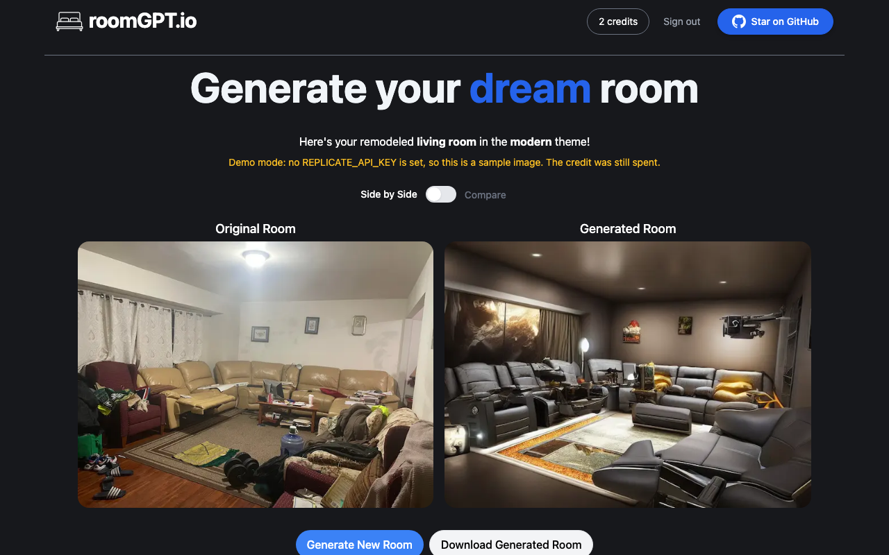
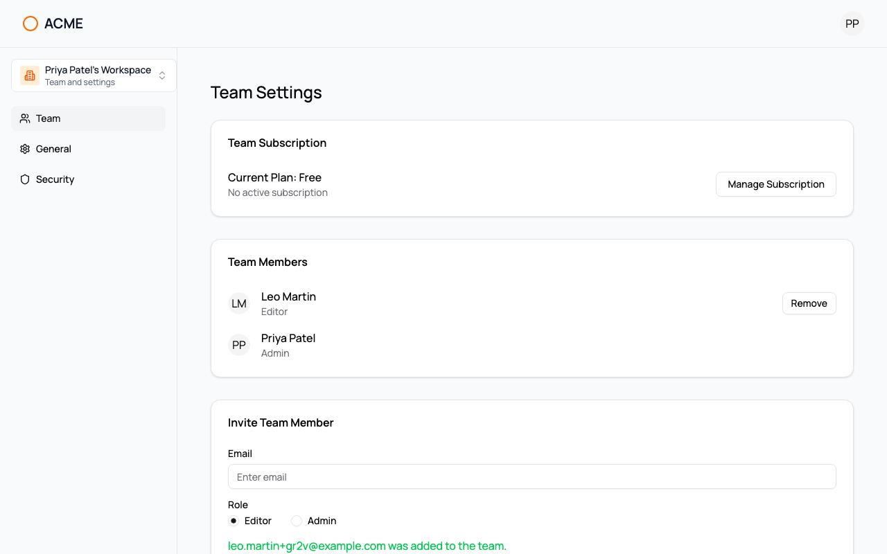
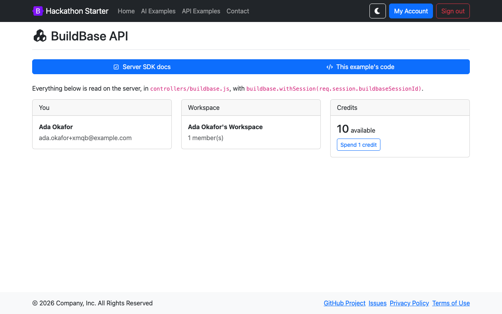

# BuildBase examples

Working apps built on [BuildBase](https://buildbase.app): auth, workspaces, billing and credits from one SDK. Most are popular open-source templates with their auth, teams or billing swapped for BuildBase, so you can read the diff against an app you already know.

Each folder is a complete app with its own README, a Deploy button and the exact console steps. Every README opens with a recorded walkthrough of the app running, so you can see what it does before you set anything up. Pick the one closest to what you are building.

## Start here

### [with-buildbase](with-buildbase)

**Sign-in for a Next.js app, and nothing else.** A hosted sign-in page, a session in an httpOnly cookie, and the user in client and server components. The smallest working integration.

Own code · Next.js · about 5 minutes

## Credits and pay-per-use AI

### [ai-chatbot](ai-chatbot)

**Every chat message spends a credit.** Vercel's Chatbot with BuildBase sign-in, a starting balance per workspace, and the credit store when it runs out. Streaming, tools, artifacts and history are unchanged.

Based on [vercel/chatbot](https://github.com/vercel/chatbot) (21k★, Apache-2.0) · Next.js · 15-25 minutes

[](https://vercel.com/new/clone?repository-url=https%3A%2F%2Fgithub.com%2Fbuildbase-app%2Fexamples&root-directory=ai-chatbot&project-name=ai-chatbot-buildbase&env=NEXT_PUBLIC_BUILDBASE_ORG_ID,NEXT_PUBLIC_BUILDBASE_CLIENT_ID,BUILDBASE_CLIENT_SECRET,NEXT_PUBLIC_BUILDBASE_REDIRECT_URL,AI_GATEWAY_API_KEY,POSTGRES_URL,BLOB_READ_WRITE_TOKEN,REDIS_URL&envDescription=Your%20org%20and%20auth%20client%20from%20the%20BuildBase%20console&envLink=https%3A%2F%2Fgithub.com%2Fbuildbase-app%2Fexamples%2Ftree%2Fmain%2Fai-chatbot)

### [ai-image-credits](ai-image-credits)

**Pay per generated image.** roomGPT with its per-IP rate limit replaced by credits: 3 free on sign-up, 1 per room, checked before the model runs and charged only once the image exists. Runs in a labelled demo mode without a Replicate key.

Based on [Nutlope/roomGPT](https://github.com/Nutlope/roomGPT) (10k★, MIT) · Next.js · 15-20 minutes

## Remix / React Router

### [epic-stack](epic-stack)

**React Router v7, server-rendered.** The Epic Stack's passwords, onboarding, GitHub OAuth, passkeys and 2FA replaced by BuildBase. Its own sessions, permissions and notes app run unchanged on top, and the React SDK renders on the server for its account screens.

Based on [epicweb-dev/epic-stack](https://github.com/epicweb-dev/epic-stack) (5.5k★, MIT) · React Router v7 · about 10 minutes

## TanStack Start

### [start-ui-web](start-ui-web)

**BuildBase next to an existing auth library.** Start UI's email one-time code and GitHub sign-in replaced by BuildBase through a small better-auth plugin, so its sessions, admin screens and oRPC permission checks keep working. The React SDK's account screens sit on the account page.

Based on [BearStudio/start-ui-web](https://github.com/BearStudio/start-ui-web) (1.7k★, MIT) · TanStack Start · about 10 minutes

## Teams, roles and billing

### [saas-starter](saas-starter)

**A SaaS starter without the plumbing.** The Next.js SaaS Starter with its hand-built auth, teams and Stripe code deleted: BuildBase workspaces, roles, plans, trials and checkout instead. No database, and half the TypeScript.

Based on [nextjs/saas-starter](https://github.com/nextjs/saas-starter) (16k★, MIT) · Next.js · 15-20 minutes

### [admin-dashboard](admin-dashboard)

**A Vite admin dashboard, made real.** Shadcn Admin's mock sign-in, team switcher, users table and account forms, now backed by BuildBase. Also the example for apps that are not Next.js: three small serverless functions do the auth.

Based on [satnaing/shadcn-admin](https://github.com/satnaing/shadcn-admin) (14k★, MIT) · Vite + React · about 10 minutes

## Plain Node.js servers

### [hackathon-starter](hackathon-starter)

**Express, Pug and no React.** Hackathon Starter's passwords, email links, 2FA and passkeys replaced by BuildBase's hosted sign-in, driven from the server. The API examples stay, and a BuildBase one joins them: workspaces and credits through the server SDK's `withSession()`.

Based on [sahat/hackathon-starter](https://github.com/sahat/hackathon-starter) (35k★, MIT) · Express · about 10 minutes

### [nestjs-boilerplate-api](nestjs-boilerplate-api)

**A NestJS REST API, no UI.** The boilerplate's email/password, JWT refresh tokens and Apple, Facebook and Google login replaced by BuildBase: a client gets the hosted page URL, posts back the code, and uses the BuildBase session as its Bearer token. Roles, users and files are upstream's.

Based on [brocoders/nestjs-boilerplate](https://github.com/brocoders/nestjs-boilerplate) (4.4k★, MIT) · NestJS · about 10 minutes

## Moving from Clerk

### [nextjs-boilerplate](nextjs-boilerplate)

**The Clerk swap, done once so you can read the diff.** Next.js Boilerplate with Clerk's middleware, provider, sign-in, user profile and `currentUser()` replaced. i18n, Drizzle, Arcjet, Sentry and the strict lint setup are upstream's and still pass.

Based on [ixartz/Next-js-Boilerplate](https://github.com/ixartz/Next-js-Boilerplate) (13k★, MIT) · Next.js · about 10 minutes

## Before you start

- **Setup time is honest.** Only `with-buildbase` is a five-minute job. The others need console steps (Stripe test keys, plans, credit packages, a workflow), each written out in its README.
- **Redirect URLs must be exact.** Register `http://localhost:3000/...` and your deployed domain on the auth client; wildcards like `*.vercel.app` are not accepted.
- **BuildBase does not run your models.** LLM calls, image generation and chat storage come from each app's own stack; BuildBase handles who the user is, which workspace they are in, and what they have paid for.

## Credits and licences

The adapted examples keep their upstream licence and copyright notice in their folder (Apache-2.0 examples also carry a NOTICE), name the commit they are based on, and mark every file they change. Star counts were checked on 24 September 2026. Our own code is [MIT](LICENSE).
