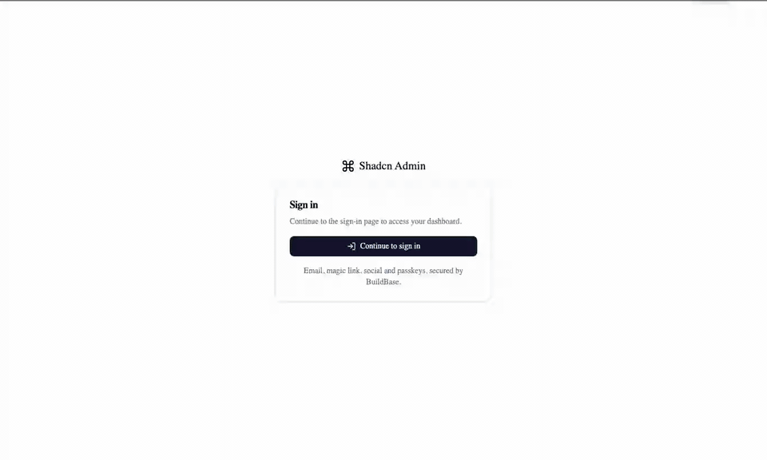
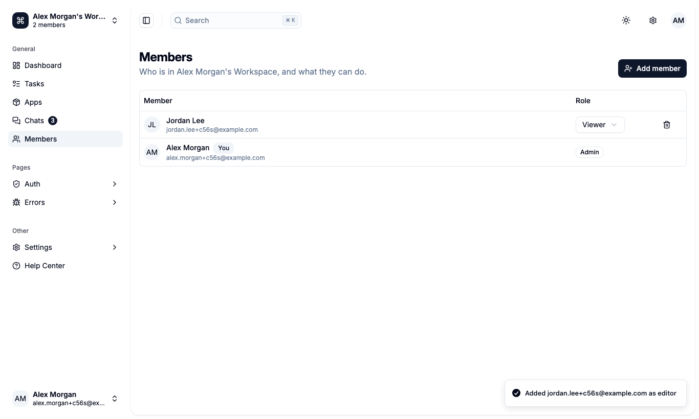
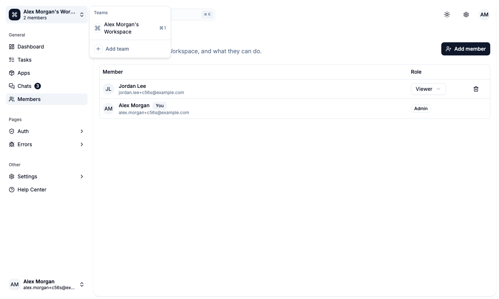
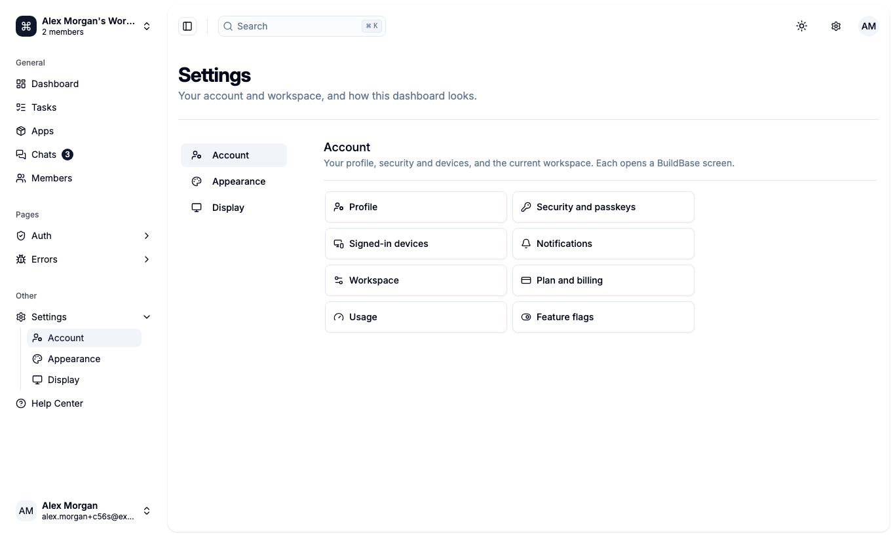

# Shadcn Admin with BuildBase

[Shadcn Admin](https://github.com/satnaing/shadcn-admin) (14k★) is a Vite + React admin dashboard whose sign-in, teams, users and account pages are mock-ups. Here they are real, backed by [BuildBase](https://buildbase.app). It is also the example for **apps that are not Next.js**: a Vite SPA with three small serverless functions.

**Guide:** [BuildBase on Vite](https://www.buildbase.app/guides/buildbase-on-vite) walks through the same setup step by step, and why each piece is there.

| Upstream (mock)                                                      | Here (BuildBase)                                                                                                                               |
| -------------------------------------------------------------------- | ---------------------------------------------------------------------------------------------------------------------------------------------- |
| Sign-in, sign-up, OTP and forgot-password forms that accept anything | Hosted sign-in (email, magic link, social, passkeys); every dashboard page requires a session                                                  |
| A team switcher with three hardcoded teams                           | The user's workspaces; **Add team** creates one                                                                                                |
| A Users table of 500 generated people                                | The workspace's real **Members**: admins add people, change roles (admin, editor, viewer) and remove them; everyone else gets a read-only view |
| Profile, Account and Notifications forms that save nowhere           | One Account page that opens BuildBase's Profile, Security, Devices, Notifications, Workspace, Plan, Usage and Feature flags screens            |
| "Upgrade to Pro", Billing                                            | The plan picker and the subscription screen                                                                                                    |

Dashboard, Tasks, Apps, Chats and the error pages are upstream's, untouched. `@clerk/react` and the `/clerk` demo section are gone, along with `zustand`, `input-otp`, `react-day-picker` and `@radix-ui/react-switch`, which only the mock pages used. Upstream's lint, knip, Prettier and its 83 browser tests pass.

## See it working

**Guarded pages, real members, teams and account screens.**



1. `/users` needs a session, so it goes to sign-in and comes back after the hosted page.
2. Add a teammate who has an account, as an editor, then make them a viewer.
3. The team switcher lists the user's workspaces; **Add team** creates one.
4. Upstream's dashboard is untouched. **Settings → Account** opens the SDK's screens.

<table><tr><td width="33%"></td><td width="33%"></td><td width="33%"></td></tr><tr><td align="center"><sub>Members and roles</sub></td><td align="center"><sub>Teams are workspaces</sub></td><td align="center"><sub>Account screens</sub></td></tr></table>

Recorded against a local BuildBase stack; still stretches are shortened. [Watch it as an MP4](../.github/media/admin-dashboard.mp4).

## How auth works without a Next.js server

The client secret must stay on a server, so `server/auth.ts` holds three plain `Request -> Response` handlers:

| Endpoint                 | Does                                                                                       |
| ------------------------ | ------------------------------------------------------------------------------------------ |
| `POST /api/auth/verify`  | Exchanges the hosted page's one-time code for a session in an httpOnly `bb-session` cookie |
| `GET /api/auth/session`  | Tells the app whether that cookie exists                                                   |
| `POST /api/auth/signout` | Clears it                                                                                  |

The same handlers run in two places: as **Vercel Functions** from `api/auth/*`, and inside **`vite dev`** through a small plugin in `vite.config.ts`. So `pnpm dev` needs nothing else running. On another host (Netlify, Cloudflare), point its functions at the same three handlers.

## Deploy

[](https://vercel.com/new/clone?repository-url=https%3A%2F%2Fgithub.com%2Fbuildbase-app%2Fexamples&root-directory=admin-dashboard&project-name=admin-dashboard-buildbase&env=VITE_BUILDBASE_ORG_ID,VITE_BUILDBASE_CLIENT_ID,VITE_BUILDBASE_REDIRECT_URL,BUILDBASE_CLIENT_SECRET&envDescription=Your%20org%20and%20auth%20client%20from%20the%20BuildBase%20console&envLink=https%3A%2F%2Fgithub.com%2Fbuildbase-app%2Fexamples%2Ftree%2Fmain%2Fadmin-dashboard%23set-up-buildbase)

`vercel.json` sends every non-API path to `index.html`, for client-side routing.

## Set up BuildBase (about 10 minutes)

1. Create an organization at [console.buildbase.app](https://console.buildbase.app) and copy its ID from **Settings → General**.
2. Under **User Management → Authentication**, create an auth client and copy its client ID and secret. The secret is shown once.
3. On that client, register the redirect URL `http://localhost:5173/sign-in`, and your deployed `https://<domain>/sign-in`. A wildcard can only stand in for one leftmost subdomain on a domain you own, so `*.vercel.app` is not accepted.
4. Enable at least one sign-in method, for example Email (magic link).
5. Under workspace settings, choose the **Platform** mode, so users can add teams. Under **Advanced Overrides**, check that **Auto-Create First Workspace** is on and **Can Invite Members** is not Disabled; both are, by default.
6. Optional: connect Stripe and publish plans, for the Plan and billing screens and the plan picker.

```bash
cp .env.example .env.local
pnpm install
pnpm dev
```

## Good to know

- **Adding a member needs an existing account.** They sign up first; then an admin adds them by email. Email invitations for new people are not in the published SDK yet.
- **A new team opens Plan and billing.** A workspace starts without a subscription, and the SDK shows the plan screen right after **Add team**. Close it to carry on.
- **After sign-in, you land where you were going.** The hosted page always returns to the one registered `/sign-in` URL, so the page someone asked for is kept in `sessionStorage` across the round trip.
- **Only `VITE_*` variables reach the browser.** `BUILDBASE_CLIENT_SECRET` is read by the functions and the dev server, never bundled.

## License

MIT, like the upstream it is based on. The original copyright notice is kept in [LICENSE](LICENSE). Based on [satnaing/shadcn-admin](https://github.com/satnaing/shadcn-admin) at `e16c87f`; modified and added files say so at the top.
