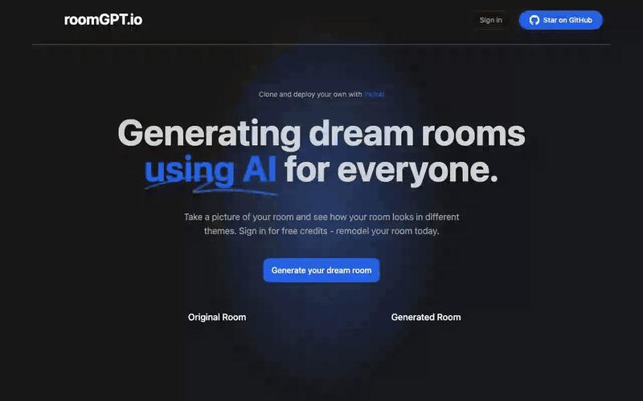
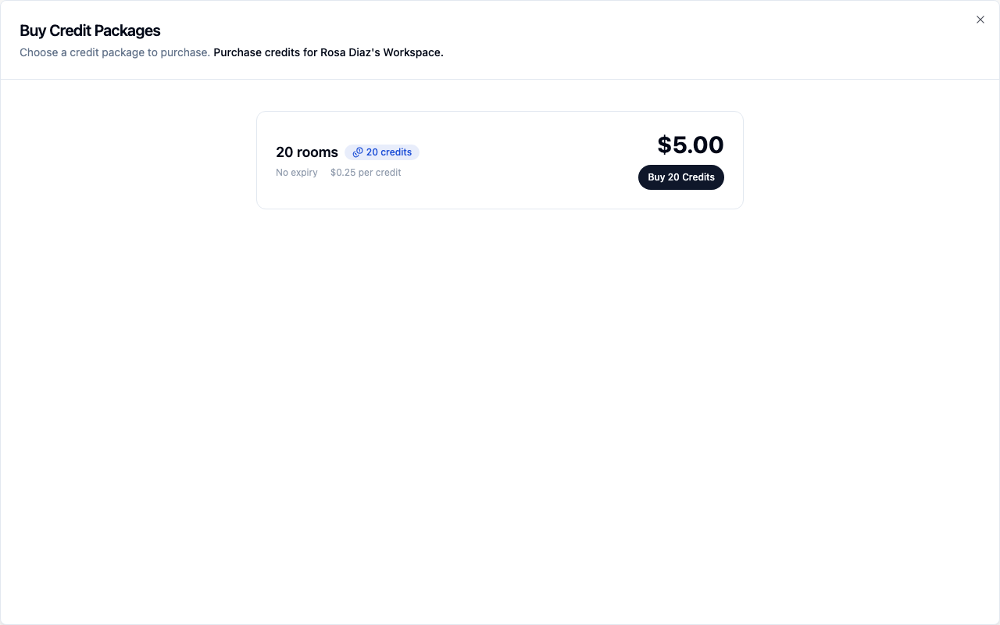
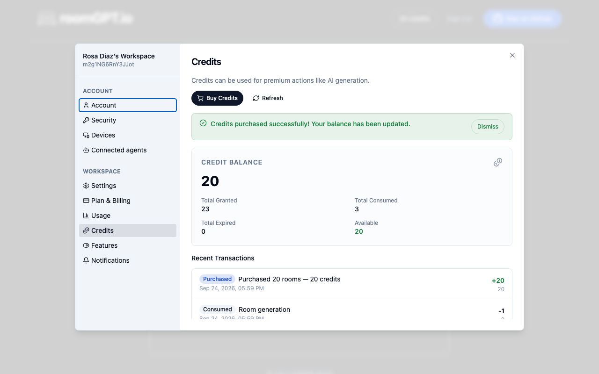

# roomGPT with BuildBase credits

[roomGPT](https://github.com/Nutlope/roomGPT) (10k★): upload a photo of a room and get it back redesigned. Upstream caps every visitor at five generations a day by IP address, with Upstash Redis. Here, people sign in and **pay per generation with credits**: new accounts start with 3, and the credit store sells more through your own Stripe account. It is the smallest complete pay-per-use AI app we know of.

| Upstream | Here |
| --- | --- |
| Anonymous, 5 generations per IP per day (Upstash rate limit) | Sign in with BuildBase; each generation spends 1 credit from the user's workspace |
| - | 3 free credits on sign-up, granted by a BuildBase workflow |
| - | Out of credits: the route answers 402 and the BuildBase credit store opens |
| - | Balance in the header, refreshed after every generation |

`@upstash/ratelimit`, `@upstash/redis` and `request-ip` are gone; `@buildbase/sdk` is in. Next.js is updated from 13.4 to 14.2.

## See it working

**Free credits, pay per image, buy more.**



1. Sign in for 3 free credits.
2. Three generations with the sample photo: 3, 2, 1, 0. (Demo mode: no Replicate key, so the result is a labelled sample image.)
3. The fourth is refused, and the credit store opens.
4. Buy 20 credits with a Stripe test card, come back to 20, generate again: 19.

<table><tr><td width="33%"></td><td width="33%"></td><td width="33%"></td></tr><tr><td align="center"><sub>A generation, one credit spent</sub></td><td align="center"><sub>Out of credits: the store</sub></td><td align="center"><sub>Back from Stripe with 20</sub></td></tr></table>

Recorded against a local BuildBase stack with Stripe in test mode; still stretches are shortened. [Watch it as an MP4](../.github/media/ai-image-credits.mp4).

## Deploy

[](https://vercel.com/new/clone?repository-url=https%3A%2F%2Fgithub.com%2Fbuildbase-app%2Fexamples&root-directory=ai-image-credits&project-name=ai-image-credits-buildbase&env=NEXT_PUBLIC_BUILDBASE_ORG_ID,NEXT_PUBLIC_BUILDBASE_CLIENT_ID,BUILDBASE_CLIENT_SECRET,NEXT_PUBLIC_BUILDBASE_REDIRECT_URL,REPLICATE_API_KEY&envDescription=Your%20org%20and%20auth%20client%20from%20the%20BuildBase%20console%2C%20and%20a%20Replicate%20token&envLink=https%3A%2F%2Fgithub.com%2Fbuildbase-app%2Fexamples%2Ftree%2Fmain%2Fai-image-credits%23set-up-buildbase)

## How the charge works

`app/generate/route.ts`, in order:

1. Reads the user with `bb().users.getProfile()`; no session, 401.
2. Checks the workspace balance **before** calling the model, so an empty balance costs you nothing at Replicate. Short, 402.
3. Runs the model.
4. Charges 1 credit **only after the image exists**, with Replicate's prediction ID as the idempotency key: a failed generation is free, and a retried request is never charged twice.

The price is `CREDITS_PER_GENERATION` in `lib/credits.ts`.

## Set up BuildBase (15-20 minutes)

**Sign-in**

1. Create an organization at [console.buildbase.app](https://console.buildbase.app) and copy its ID from **Settings → General**.
2. Under **User Management → Authentication**, create an auth client and copy its client ID and secret. The secret is shown once.
3. On that client, register the redirect URL `http://localhost:3000/dream`, and your deployed `https://<domain>/dream`. Wildcards like `*.vercel.app` are not accepted.
4. Enable at least one sign-in method, for example Email (magic link).
5. Under workspace settings, turn on **auto-create first workspace**. Credits belong to a workspace, so every user needs one.

**Credits**

6. Connect Stripe (test keys are fine) under **Billing → Credentials**.
7. Under **Billing → Credit Packages**, create a package, for example 20 credits for $5.
8. Under **Workflows**, create one triggered by **Workspace Created** with a **Grant Credits** action: amount 3, workspace `{{trigger.workspaceId}}`. Publish it. This is what gives new users their free credits.

**Environment**

```bash
cp .env.example .env.local
npm install
npm run dev
```

| Variable | What it is |
| --- | --- |
| `NEXT_PUBLIC_BUILDBASE_ORG_ID` | Your org ID |
| `NEXT_PUBLIC_BUILDBASE_CLIENT_ID` / `BUILDBASE_CLIENT_SECRET` | The auth client. The secret is **server only** |
| `NEXT_PUBLIC_BUILDBASE_REDIRECT_URL` | The exact `/dream` URL from step 3 |
| `REPLICATE_API_KEY` | Optional. Without it, **demo mode**: credits are spent but the result is a sample image, labelled as such |
| `NEXT_PUBLIC_UPLOAD_API_KEY` | Optional [Bytescale](https://www.bytescale.com) key for uploads |
| `NEXT_PUBLIC_BUILDBASE_SERVER_URL` | Optional; defaults to `https://api.console.buildbase.app` |

## Good to know

- **Read the balance with `useCreditBalanceContext()`**, not `useCreditBalance(workspaceId)`. Only the context refreshes when `invalidateCreditBalance()` is called, and import that from `@buildbase/sdk/react`: the root entry is a separate bundle with its own copy.
- **A balance read can come early.** The sign-up grant runs in a workflow just after the workspace is created, and purchased credits arrive with Stripe's webhook, which can land after the page has reloaded. `components/Account.tsx` re-checks for a few seconds in both cases, using `readBBParams()` to spot the return from a purchase.
- **Check and charge are two calls.** Two generations started at the same moment on the last credit can both pass the check; the second is then refused at the charge, after the model has run. Fine for a demo; for expensive models, charge first and refund on failure.
- **Credit consumption is rate limited** to 30 requests a minute per IP.
- **"Use a sample photo"** only works with Replicate on a public deployment, since Replicate has to fetch the image. Locally it is for demo mode.

## License

MIT, like the upstream it is based on. The original copyright notice is kept in [LICENSE](LICENSE). Based on [Nutlope/roomGPT](https://github.com/Nutlope/roomGPT) at `611398c`; modified and added files say so at the top.
