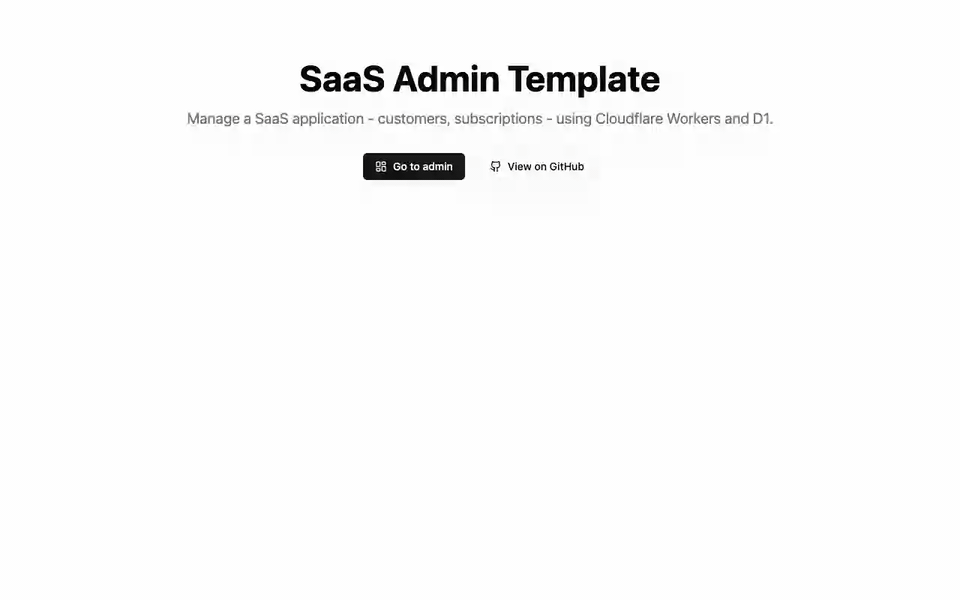
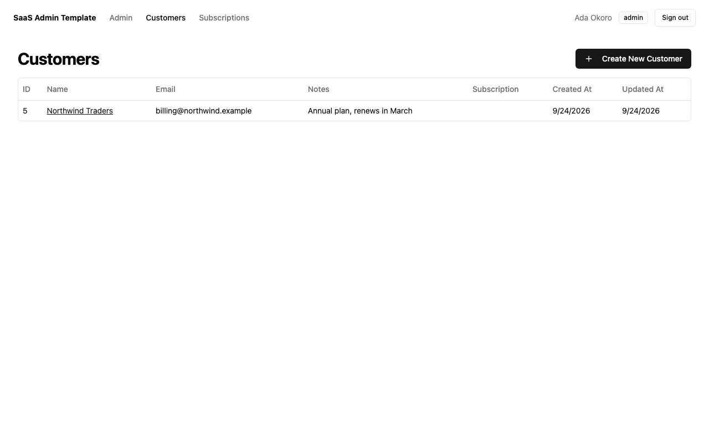
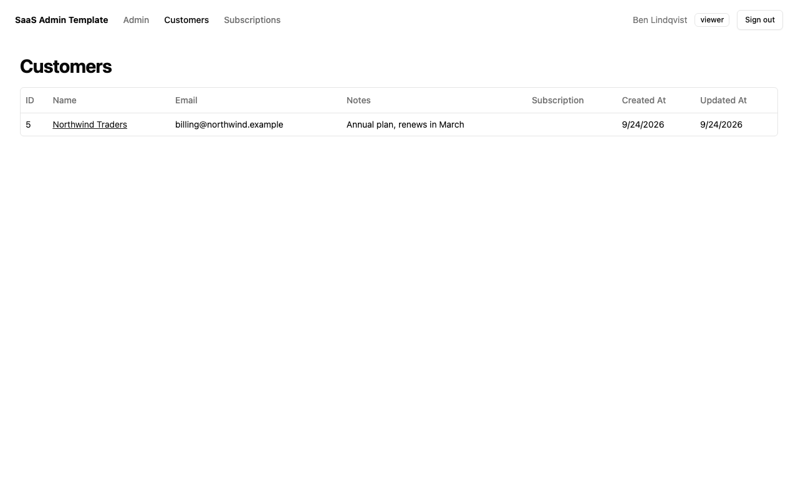
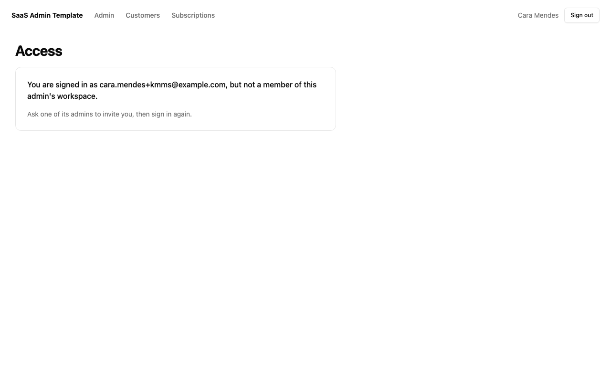

# SaaS Admin Template with BuildBase

[Cloudflare's SaaS Admin Template](https://github.com/cloudflare/templates/tree/main/saas-admin-template) is an admin dashboard for customers and subscriptions: Astro with React islands and shadcn/ui, on Cloudflare Workers, with D1 for data and a Workflow per customer. Here [BuildBase](https://buildbase.app) decides who may use it. It is the example for **Astro**, and for **roles from a BuildBase workspace**.

Upstream, `/admin` has no sign-in at all: anyone with the URL sees every customer. Its API checks one shared `API_TOKEN`, and the admin's own "Create" dialogs work by handing that token to the browser as a React prop. Here:

| Upstream | With BuildBase |
| --- | --- |
| `/admin` open to anyone | Sign in on BuildBase's hosted page first |
| Everyone who can load the page is an admin | The admin belongs to one BuildBase workspace. Its **admins** and **editors** can change data, its **viewers** can only read, and nobody else gets in |
| The dialogs call the API with `API_TOKEN`, sent to the browser | They call it with the person's BuildBase session; the token never leaves the server |
| `API_TOKEN` required for the UI to work | Optional, and still accepted on `/api` for machine clients |

One middleware does the checking, for pages and the API alike. The customers, subscriptions, D1 schema, Workflow and UI are upstream's.

## See it working

**An admin creates a customer; a viewer can look but not change; a stranger is kept out.**



1. **Go to admin** redirects to the hosted page. Ada signs in with a magic link and lands on `/admin`; the header says `admin`.
2. **Create New Customer**: the dialog posts to `/api/customers` with her session cookie, and there is no API token in the page. The customer appears.
3. She signs out. Ben, whom she invited to the workspace as a `viewer`, signs in: he sees the customer, but no create button, and a `POST /api/customers` from his browser gets **403** `Viewers can read, not change.`
4. Cara has a BuildBase account but is not in the workspace. Every `/admin` page sends her to "not a member", and the API answers 403.

<table><tr><td width="33%"></td><td width="33%"></td><td width="33%"></td></tr><tr><td align="center"><sub>Admin</sub></td><td align="center"><sub>Viewer</sub></td><td align="center"><sub>Not a member</sub></td></tr></table>

Recorded under `wrangler dev` (workerd, with a local D1) against a local BuildBase stack; the waits for magic-link emails are cut. [Watch it as an MP4](../.github/media/astro-saas-admin.mp4).

## How it works

- **[`src/middleware.ts`](src/middleware.ts)** runs on every request. With a `bb_session` cookie, it asks BuildBase who the session belongs to (`users.getProfile()`), which workspaces they are in (`workspace.list()`), and their role in the admin workspace (`users.list(workspaceId)`). It puts the result on `Astro.locals.member`, then applies the rule below. A session BuildBase no longer knows is cleared.
- **The rule** is `decide()` in [`src/lib/buildbase.ts`](src/lib/buildbase.ts), a pure function with its own tests. `/admin` and `/api` need a member of `ADMIN_WORKSPACE_ID`; anything but `GET` on `/api` needs `admin` or `editor`; a valid `API_TOKEN` passes on `/api` only.
- **Sign-in** is [`/auth/sign-in`](src/pages/auth/sign-in.ts), which stores a random state and redirects to the URL from `AuthApi.requestAuth()`, and [`/auth/callback`](src/pages/auth/callback.ts), which checks the state and exchanges the code with the client secret for a BuildBase session ID. [`/auth/sign-out`](src/pages/auth/sign-out.ts) ends the BuildBase session too.
- **Pages** hide the create and workflow buttons from viewers. The API enforces it regardless.
- **CSRF**: Astro checks the `Origin` of form posts itself (`security.checkOrigin`, on by default), so a cross-site sign-out or form post is refused.

## Set up

### BuildBase (about 10 minutes)

1. Create an organization at [console.buildbase.app](https://console.buildbase.app) and copy its ID from **Settings → General**.
2. Under **User Management → Authentication**, create an auth client and copy its client ID and secret. The secret is shown once.
3. On that client, register `http://localhost:4321/auth/callback` as a redirect URL, and your deployed `https://<your worker>/auth/callback`. They must match exactly.
4. Enable at least one sign-in method, for example Email (magic link).

### The app

```bash
npm install
npx wrangler d1 create admin-db         # then put the new database_id in wrangler.jsonc
cp .dev.vars.example .dev.vars          # the BUILDBASE_* values
npm run dev                             # migrates the local D1, builds, and serves on http://localhost:4321
```

Then choose the workspace that runs the admin:

1. Open `http://localhost:4321/admin` and sign in. With `ADMIN_WORKSPACE_ID` unset, the page lists your BuildBase workspaces and their IDs. BuildBase creates one for you at sign-up, and you are its `admin`.
2. Put that ID in `ADMIN_WORKSPACE_ID` and restart.
3. Invite teammates into that workspace with a role: `editor` to change data, `viewer` to read. Any app with BuildBase's workspace settings can do it, or the server SDK's `users.invite(workspaceId, email, role)`.

| Variable | What it is |
| --- | --- |
| `BUILDBASE_ORG_ID` | Your org ID |
| `BUILDBASE_CLIENT_ID` / `BUILDBASE_CLIENT_SECRET` | The auth client. The secret stays on the server |
| `ADMIN_WORKSPACE_ID` | The BuildBase workspace whose members run this admin |
| `BUILDBASE_SERVER_URL` | Optional; defaults to `https://api.console.buildbase.app` |
| `API_TOKEN` | Optional. Machine clients can still call `/api` with it |

In production, set the IDs under `vars` in [`wrangler.jsonc`](wrangler.jsonc) and the secrets with `npx wrangler secret put BUILDBASE_CLIENT_SECRET` (and `API_TOKEN`), then `npm run deploy`. D1 and the Workflow are set up as upstream's [README](https://github.com/cloudflare/templates/blob/a0bb6ef9a990a5ec4afecab50edf56c69676b031/saas-admin-template/README.md) describes.

## Good to know

- **Every request asks BuildBase.** The middleware makes up to three calls per request to learn the person's role, which keeps a removed teammate out immediately. For a busy admin, cache the result for a minute (in KV, say) and accept that delay.
- **Tests.** `npm test` runs the access rule's tests on Node 22.18 or later, which runs TypeScript directly. The sign-in and the three roles were checked end to end against a local BuildBase, as the recording shows.
- **Type errors are upstream's.** `tsc` reports about a hundred in upstream's files (untyped API handlers and table columns). The template ships without a typecheck, and so does this example; CI builds it and runs a Worker dry-run deploy.

## License

MIT, like the upstream it is based on; the notice is in [LICENSE](LICENSE). Based on [cloudflare/templates](https://github.com/cloudflare/templates) `saas-admin-template` at `a0bb6ef`; modified and added files say so at the top or where they change.
