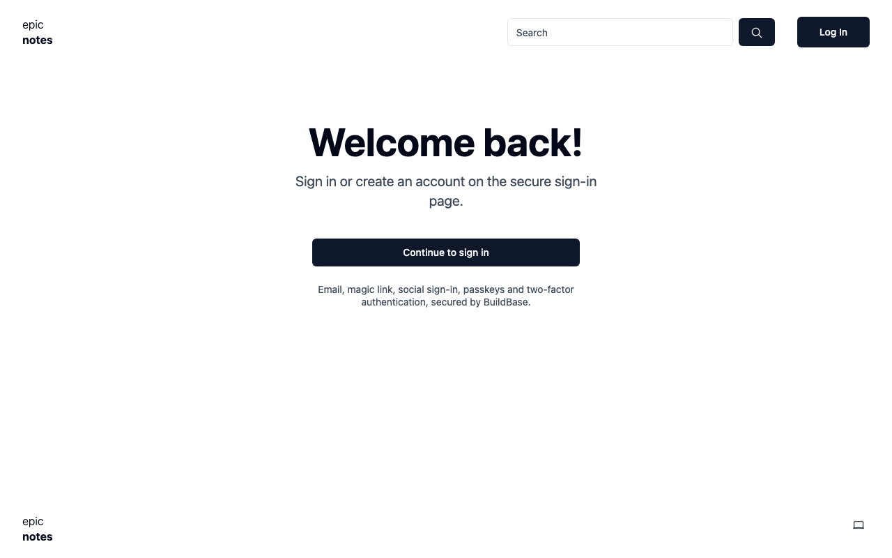
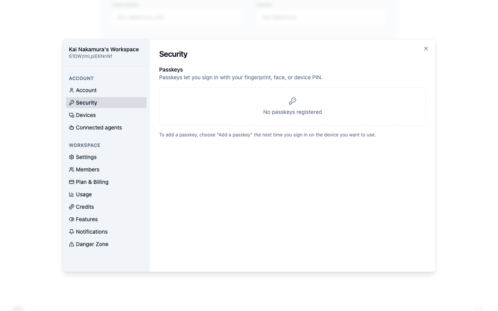
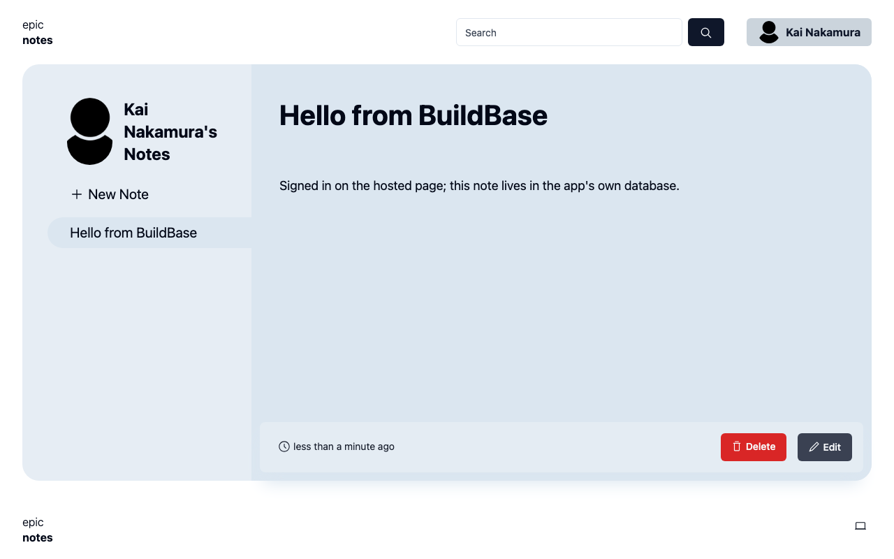

# Epic Stack with BuildBase

[The Epic Stack](https://github.com/epicweb-dev/epic-stack) (5.5k★) is Kent C.
Dodds' full-stack starter on **React Router v7**, the framework Remix became,
with Express, Prisma on SQLite and a notes app. Here its hand-built
authentication is replaced by [BuildBase](https://buildbase.app). It is the
example for **Remix / React Router v7**, and for using the React SDK in a
server-rendered app.

| Upstream builds itself                                           | Here, BuildBase does it                                                                    |
| ---------------------------------------------------------------- | ------------------------------------------------------------------------------------------ |
| Username and password (bcrypt), sign-up, onboarding              | The hosted sign-in page: email, magic link, social, passkeys, 2FA, as the org enables them |
| Email verification, forgot and reset password, change email      | Same hosted page, and the account screens                                                  |
| GitHub OAuth through `remix-auth`                                | Social sign-in on the hosted page                                                          |
| Passkeys (`@simplewebauthn`) and TOTP 2FA (`@epic-web/totp`)     | Same hosted page, and the SDK's Security screen                                            |
| Five settings pages: email, 2FA, password, connections, passkeys | Buttons that open the SDK's Security, Devices and Account screens                          |

About 4,200 lines of app code and 1,000 of tests are gone. Prisma loses four
models (`Password`, `Verification`, `Connection`, `Passkey`) and `User` gains
`buildbaseId`, in one migration. `bcryptjs`, `remix-auth`, `remix-auth-github`,
`@simplewebauthn/*` and `@epic-web/totp` are out; `@buildbase/sdk` is in. The
notes app, roles and permissions, image uploads, caching and the rest are
upstream's, untouched.

## See it working

**Sign-in with the redirect kept, the SDK's screens, and the notes app on the
same session.**


1. Opening settings while signed out goes to
   `/login?redirectTo=/settings/profile`: one button to the hosted page.
2. After signing up there, you land back on settings, not the home page.
3. **Security and passkeys** opens the SDK's own screen; so do Devices and
   Account.
4. The notes app is upstream's: a new note is saved for the user, whose username
   was made from their email.
5. Signing out ends both sessions, and settings asks for sign-in again.

<table><tr><td width="33%"></td><td width="33%"></td><td width="33%"></td></tr><tr><td align="center"><sub>Login: one button</sub></td><td align="center"><sub>The SDK's Security screen</sub></td><td align="center"><sub>A note, on the BuildBase session</sub></td></tr></table>

Recorded against a local BuildBase stack; still stretches are shortened.
[Watch it as an MP4](../.github/media/epic-stack.mp4).

## How sign-in works here

BuildBase proves who someone is; the Epic Stack then opens **its own session
exactly as before**, so `getUserId()`, `requireUserId()`, permissions and every
loader built on them are unchanged.

1. **`/login`** (`app/routes/_auth/login.tsx`): the action stores a random
   `state` and the `redirectTo` in the httpOnly session cookie, asks
   `AuthApi.requestAuth()` for the hosted page URL, and redirects there.
2. **`/auth/buildbase/callback`** (`auth.buildbase.callback.ts`): checks
   `state`, exchanges the code at `POST /api/v1/auth/token` with the client
   secret, and reads the user with `buildbaseFor(sessionId).users.getProfile()`.
3. **`createSessionForBuildBaseUser`** (`app/utils/auth.server.ts`): finds the
   `User` by `buildbaseId` (or adopts one with the same email), creates one if
   needed, opens a Prisma `Session`, and stores both session IDs in the cookie.
4. **`/logout`** deletes the app's session and ends the BuildBase one.

The React SDK is only there for its prebuilt screens.
`app/components/buildbase-provider.tsx` mounts `SaaSOSProvider` in `root.tsx`,
and gets the BuildBase session from `/resources/buildbase-session`, so the
cookie itself stays httpOnly. It renders on the server without trouble; the auth
state resolves in the browser.

## Set up BuildBase (about 10 minutes)

1. Create an organization at
   [console.buildbase.app](https://console.buildbase.app) and copy its ID from
   **Settings → General**.
2. Under **User Management → Authentication**, create an auth client and copy
   its client ID and secret. The secret is shown once.
3. On that client, register the redirect URL
   `http://localhost:3000/auth/buildbase/callback`, and the same path on your
   deployed domain.
4. Enable at least one sign-in method, for example Email (magic link).
5. Under workspace settings, check that **Auto-Create First Workspace** (under
   **Advanced Overrides**) is on; it is by default. The account screens open
   for a workspace.

```bash
cp .env.example .env    # then fill in the four BUILDBASE_* values
npm install
npx prisma migrate deploy && npx prisma generate --sql && npx prisma db seed
npm run dev
```

| Variable                                          | What it is                                                |
| ------------------------------------------------- | --------------------------------------------------------- |
| `BUILDBASE_ORG_ID`                                | Your org ID. Sent to the browser for the React SDK        |
| `BUILDBASE_CLIENT_ID` / `BUILDBASE_CLIENT_SECRET` | The auth client. The secret stays on the server           |
| `BUILDBASE_SERVER_URL`                            | Optional; defaults to `https://api.console.buildbase.app` |

Until the org, client ID and secret are set, the login page says so and the
button is disabled. Everything else (Fly.io deployment, Sentry, Resend, Tigris
image storage, the test suites) is upstream's and documented in its [docs](docs)
and
[README](https://github.com/epicweb-dev/epic-stack/blob/8473afd804b66dba6a23f317908dc35d1535e90d/README.md).
The Epic Stack needs **Node 22**.

## Good to know

- **The React SDK remembers the last signed-out page.** It jumps there on its
  next sign-in, which would undo the server's own redirect. This app never uses
  the SDK's `signIn()`, so `buildbase-provider.tsx` calls `clearAuthIntent()`
  before the SDK starts.
- **Usernames come from the email.** `kai.nakamura@example.com` becomes
  `kai_nakamura`, with a suffix if it is taken; people can change it in
  settings.
- **An existing user is adopted by email** on their first BuildBase sign-in.
- **Seeded users cannot sign in** until an account with their email exists in
  your BuildBase org; the seed is demo content.

## License

MIT, like the upstream it is based on. The original copyright notice is kept in
[LICENSE.md](LICENSE.md). Based on
[epicweb-dev/epic-stack](https://github.com/epicweb-dev/epic-stack) at
`8473afd`; modified and added files say so at the top.
