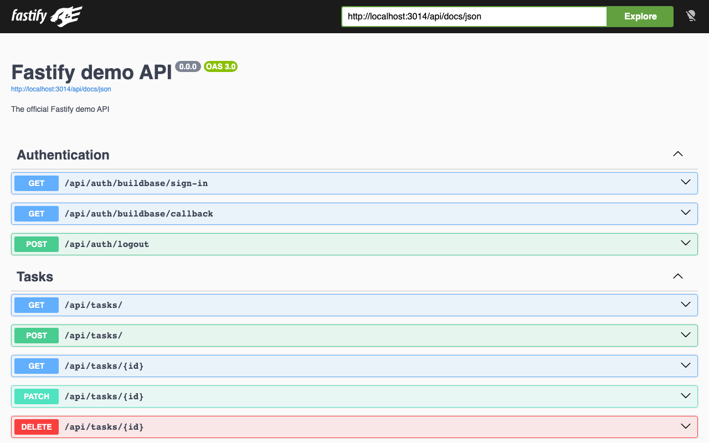
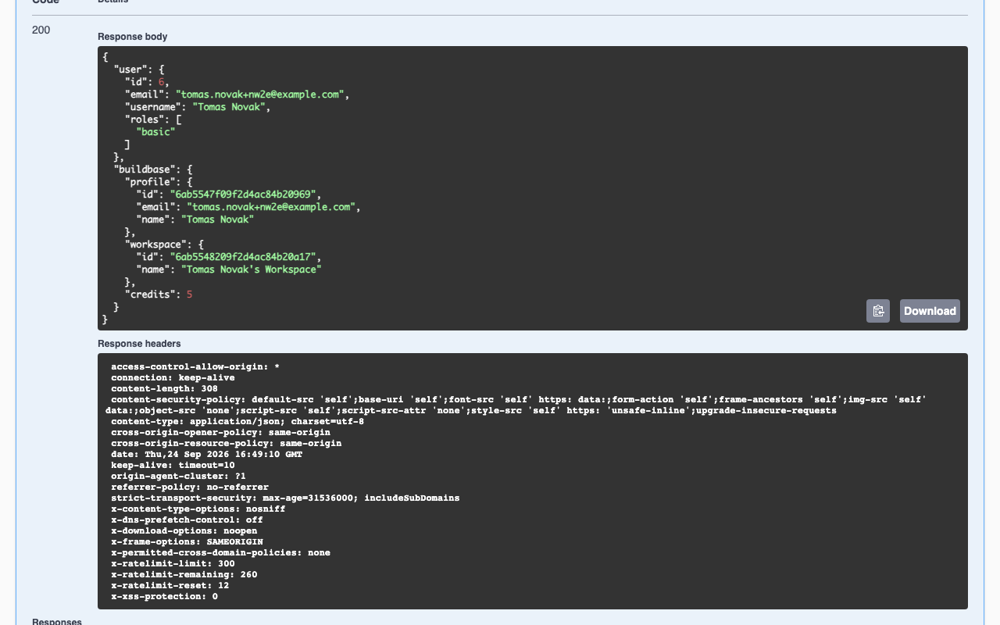
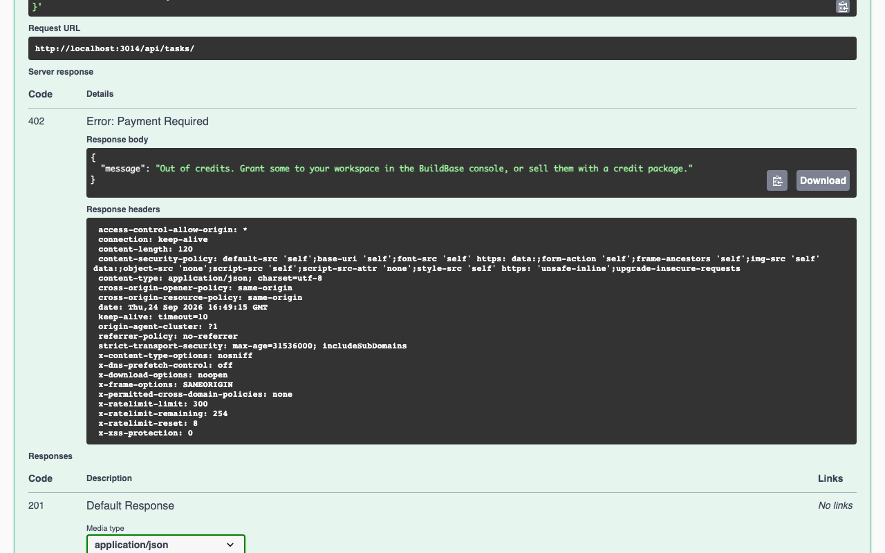

# Fastify demo with BuildBase

[The official Fastify demo](https://github.com/fastify/demo) is the Fastify team's reference for how they would structure an application: a task API with MySQL through knex, sessions, role-based access, file uploads, CSV export, rate limiting, Swagger and a `node:test` suite. Here its sign-in is replaced by [BuildBase](https://buildbase.app), and creating a task spends a BuildBase credit. It is the example for **Fastify**, and for **metering an API per call**.

| Upstream builds itself | Here, BuildBase does it |
| --- | --- |
| `POST /api/auth/login` with an email and password | A round trip through the hosted sign-in page: email, magic link, social, passkeys, 2FA, as the org enables them |
| Password hashing with scrypt (`password-manager.ts`) | BuildBase stores and checks credentials |
| `PUT /api/users/update-password` | Changed on the BuildBase account, not in the app |
| Nothing: every call is free | `POST /api/tasks` spends one credit from the user's workspace, and answers 402 when it is empty |

The sign-in callback puts the same `{ id, email, username, roles }` on `request.session.user` that the old login did, so every other route, the `isModerator` and `isAdmin` checks, and the session plugin are upstream's. One migration adds `users.buildbase_id` and drops the password column. Across `src`, `test`, `scripts` and `migrations`, 20 files change; `@buildbase/sdk` is the one new dependency.

## See it working

**Sign up through BuildBase, then call the API from its own Swagger docs until the credits run out.**


1. Swagger at `/api/docs` lists the BuildBase sign-in endpoints in place of `POST /login`.
2. `GET /api/auth/buildbase/sign-in` goes to the hosted page; sign up there. BuildBase returns to the callback, which opens the session and lands on `/api`: `Hello Tomas Novak!`.
3. `GET /api/users/me` shows this app's user (role `basic`) next to what the server SDK reads from BuildBase: the profile, the workspace BuildBase created at sign-up, and its 5 starting credits.
4. `POST /api/tasks` answers 201 five times. The sixth answers **402**, and no task is written.
5. `POST /api/auth/logout` ends the BuildBase session too; `/api` answers 401 right after.

<table><tr><td width="33%"></td><td width="33%"></td><td width="33%"></td></tr><tr><td align="center"><sub>Swagger</sub></td><td align="center"><sub>GET /api/users/me</sub></td><td align="center"><sub>402 when out of credits</sub></td></tr></table>

Recorded against a local BuildBase stack on MySQL 8.4; still stretches are shortened. [Watch it as an MP4](../.github/media/fastify-demo.mp4).

## How it works

Everything BuildBase-specific is in [`src/plugins/app/buildbase.ts`](src/plugins/app/buildbase.ts), which decorates the instance with `fastify.buildbase`:

- **`GET /api/auth/buildbase/sign-in`** stores a random `state` in the session and redirects to the URL from `AuthApi.requestAuth()`.
- **`GET /api/auth/buildbase/callback`** checks `state`, exchanges the one-time `code` for a BuildBase session ID with the client secret, and reads the profile with the server SDK. It then finds the user by BuildBase ID, adopts one with the same email, or creates one with the `basic` role, all in one transaction.
- **The server SDK** is bound per call with `withSession()`, since Fastify has no async request context. The BuildBase session ID lives in the Fastify session, next to `user`.
- **`POST /api/tasks`** calls `credits.consume()` before the insert. Send an `Idempotency-Key` header and a retried request is charged once.
- **`POST /api/auth/logout`** revokes the BuildBase session and destroys the Fastify one.

## Set up BuildBase (about 10 minutes)

1. Create an organization at [console.buildbase.app](https://console.buildbase.app) and copy its ID from **Settings → General**.
2. Under **User Management → Authentication**, create an auth client and copy its client ID and secret. The secret is shown once.
3. On that client, register `http://localhost:3000/api/auth/buildbase/callback` as a redirect URL. It must match exactly.
4. Enable at least one sign-in method, for example Email (magic link).
5. For starting credits, add a workflow: **Workspace Created → Grant Credits** (the demo grants 5), and publish it. Without it, the first `POST /api/tasks` answers 402, which is also a fair test.

```bash
cp .env.example .env   # set COOKIE_SECRET and the BUILDBASE_* values
docker compose up -d   # MySQL 8.4, as upstream
npm install
npm run db:migrate
npm run db:seed        # the roles, and three example users; needs CAN_SEED_DATABASE=1
npm run dev            # Swagger at http://localhost:3000/api/docs
```

Then open `http://localhost:3000/api/auth/buildbase/sign-in` in the browser. Swagger shares the session cookie, so every route can be tried from `/api/docs` afterwards.

| Variable | What it is |
| --- | --- |
| `BUILDBASE_ORG_ID` | Your org ID |
| `BUILDBASE_CLIENT_ID` / `BUILDBASE_CLIENT_SECRET` | The auth client. The secret stays on the server |
| `APP_URL` | Where this API runs; the callback URL is built from it |
| `BUILDBASE_SERVER_URL` | Optional; defaults to `https://api.console.buildbase.app` |

The API boots without the BuildBase values and serves its docs; sign-in answers with the variables it is missing. The database, session and upload settings, and the `db:create` and `db:drop` scripts, are upstream's.

## Good to know

- **Roles come from this app.** New users get `basic`, which the seed creates. The seed's `moderator@example.com` and `admin@example.com` keep their roles when someone with that email first signs in through BuildBase, which is how to try the moderator and admin routes.
- **Rate limit.** Upstream's global limit counts every request, Swagger's own assets included. `.env.example` sets 8 per minute for the tests; raise `RATE_LIMIT_MAX` for anything else.
- **Tests.** `npm test` needs MySQL, as upstream's does. BuildBase is replaced by a fake passed through the plugin options in [`test/helper.ts`](test/helper.ts), so the suite drives the real sign-in routes with no BuildBase org or network. The login, password and scrypt tests went with the password; new ones cover the callback's state check, adoption by email, logout and the credit charge.
- **Sessions are in memory**, as upstream's are, so a restart signs everyone out. Use a store for `@fastify/session` in production.

## License

MIT, like the upstream it is based on. The original copyright notice is kept in [LICENSE](LICENSE). Based on [fastify/demo](https://github.com/fastify/demo) at `5cd5601`; modified and added files say so at the top or where they change.
