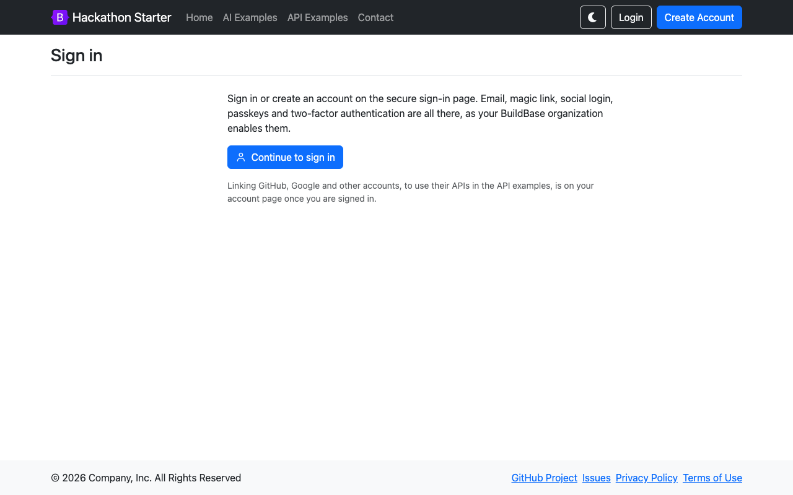
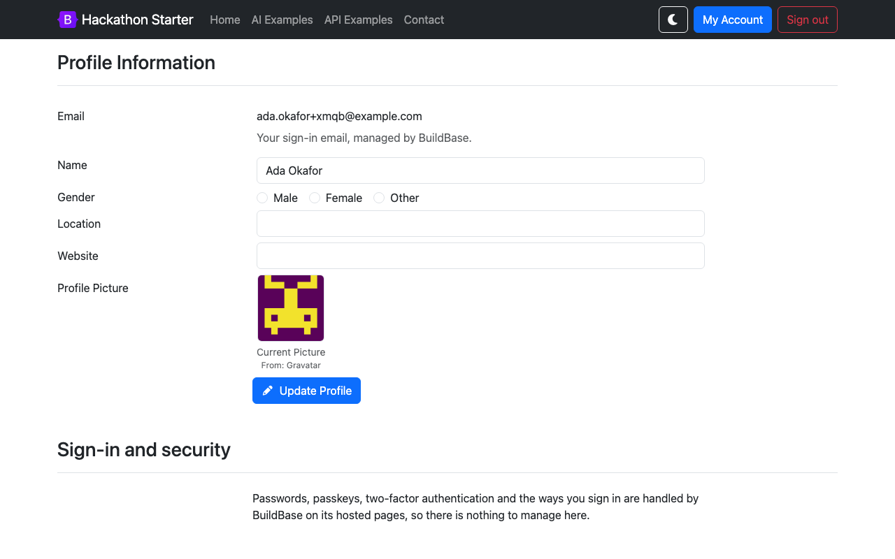

# Hackathon Starter with BuildBase

[Hackathon Starter](https://github.com/sahat/hackathon-starter) (35k★) is the Express + Pug boilerplate with sign-in, an account page and some 30 API examples. Here its whole sign-in system is replaced by [BuildBase](https://buildbase.app), and a BuildBase card joins the API examples. It is the example for **a plain Express server, with no React at all**.

| Upstream builds itself                                        | Here, BuildBase does it                                                                            |
| ------------------------------------------------------------- | -------------------------------------------------------------------------------------------------- |
| Email and password (bcrypt), sign-up, password reset          | The hosted sign-in page: email, magic link, social, passkeys, as the org enables them              |
| Email-link login, email verification                          | Same hosted page                                                                                   |
| Passkeys (`@simplewebauthn`) and TOTP / email 2FA (`otpauth`) | Passkeys: the hosted page. 2FA: removed                                                            |
| "Sign in with Google / GitHub / ..." through Passport         | Social sign-in on the hosted page. Passport stays only to **link** a provider for the API examples |
| "Logout everywhere" across this app's sessions                | Ends every BuildBase session too, on every device                                                  |
| -                                                             | A workspace per user on first sign-in, and credits, read with the server SDK                       |

About 2,000 lines of app code are gone: `controllers/user.js` and `controllers/webauthn.js`, 1,384 lines between them, are now one `user.js` of about 240 lines, the user model lost its password, token, 2FA and passkey fields, and seven views are deleted. `passport-local`, `@simplewebauthn/*`, `otpauth`, `qr`, `@node-rs/bcrypt` and `mailchecker` are out; `@buildbase/sdk` is in. The API and AI examples are upstream's, untouched.

## See it working

**Sign-in, the account page, and the server SDK from an Express route.**


1. The login page is one button to BuildBase's hosted page, which offers sign-in and sign-up.
2. Back in the app, signed in: Passport's session carries the user as before, so every existing route keeps working.
3. The account page keeps upstream's profile and linked accounts. The email belongs to the BuildBase account, and security settings live on the hosted pages.
4. **API Examples → BuildBase** reads the profile, the workspace and its credits on the server, and spends one. The new workspace started with 10 credits from a "Workspace Created" workflow.
5. Resubmitting the same form spends nothing more: the form carries an idempotency key.
6. Sign out ends the BuildBase session; `/account` then sends you to login.

<table><tr><td width="33%"></td><td width="33%"></td><td width="33%"></td></tr><tr><td align="center"><sub>Login: one button</sub></td><td align="center"><sub>The account page</sub></td><td align="center"><sub>The BuildBase API example</sub></td></tr></table>

Recorded against a local BuildBase stack; still stretches are shortened. [Watch it as an MP4](../.github/media/hackathon-starter.mp4).

## How sign-in works on a plain Express server

There is no React here, so the server drives sign-in itself, in `config/buildbase.js`:

1. **`POST /login`** calls `AuthApi.requestAuth()` from `@buildbase/sdk` for the hosted page URL, with a random `state` kept in the session, and redirects there.
2. The hosted page returns to **`GET /auth/buildbase/callback?code=...&state=...`**. The server checks `state`, exchanges the code at `POST /api/v1/auth/token` with the client secret, and stores the BuildBase session ID in the Express session.
3. It reads the BuildBase user with `users.getProfile()`, finds or creates the app's own `User` by BuildBase ID, and calls `req.logIn()`, so `req.user` and `passport.session()` carry on as upstream wrote them.
4. Every later call binds the session per request: **`buildbase.withSession(req.session.buildbaseSessionId)`**. Express has no async request context, which is what `withSession()` is for.

## Set up BuildBase (about 10 minutes)

1. Create an organization at [console.buildbase.app](https://console.buildbase.app) and copy its ID from **Settings → General**.
2. Under **User Management → Authentication**, create an auth client and copy its client ID and secret. The secret is shown once.
3. On that client, register the redirect URL `http://localhost:8080/auth/buildbase/callback` (your `BASE_URL` plus `/auth/buildbase/callback`), and the same path on your deployed domain.
4. Enable at least one sign-in method, for example Email (magic link).
5. Under workspace settings, check that **Auto-Create First Workspace** (under **Advanced Overrides**) is on; it is by default, so each user gets one.
6. Optional, for the credits card: a **Workflows** entry triggered by **Workspace Created** with a **Grant Credits** action (amount 10, workspace `{{trigger.workspaceId}}`).

```bash
npm install
# MongoDB must be running (upstream's requirement). Then set the four
# BUILDBASE_* values in .env.example, or export them, and:
npm start
```

| Variable                                          | What it is                                                |
| ------------------------------------------------- | --------------------------------------------------------- |
| `BUILDBASE_ORG_ID`                                | Your org ID                                               |
| `BUILDBASE_CLIENT_ID` / `BUILDBASE_CLIENT_SECRET` | The auth client. The secret stays on the server           |
| `BUILDBASE_SERVER_URL`                            | Optional; defaults to `https://api.console.buildbase.app` |
| `BASE_URL`                                        | Upstream's; the callback URL is built from it             |

Everything else (the API and AI example keys, SMTP for the contact form, MongoDB) is upstream's and documented in the [upstream README](https://github.com/sahat/hackathon-starter/blob/14229eff8f9b892038ed30d0a338312f3b9d60d2/README.md). Until the three BuildBase values are set, the login page says so and the button is disabled.

## Good to know

- **Linking a provider is not signing in.** GitHub, Google and the rest still use Passport, but only to attach a token to someone already signed in, so the API examples can call that provider. Visiting `/auth/github` signed out asks you to sign in first.
- **Deleting an account deletes this app's data.** The BuildBase account stays, and signing in again starts a fresh profile.
- **An existing user is adopted by email.** A `User` from before BuildBase, with the same email, is linked to the BuildBase ID on first sign-in.
- **No git hooks.** Upstream installs husky hooks from `npm install`; in a folder of a shared examples repo they would land on the whole repo, so they are removed. Run `npm run lint-check` and `npm test` yourself.

## License

MIT, like the upstream it is based on. The original copyright notice is kept in [LICENSE](LICENSE). Based on [sahat/hackathon-starter](https://github.com/sahat/hackathon-starter) at `14229ef`; modified and added files say so at the top.
