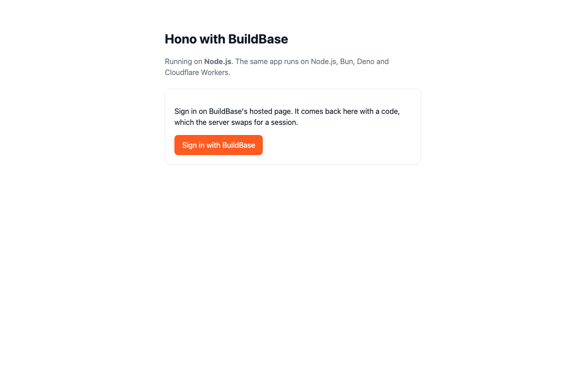
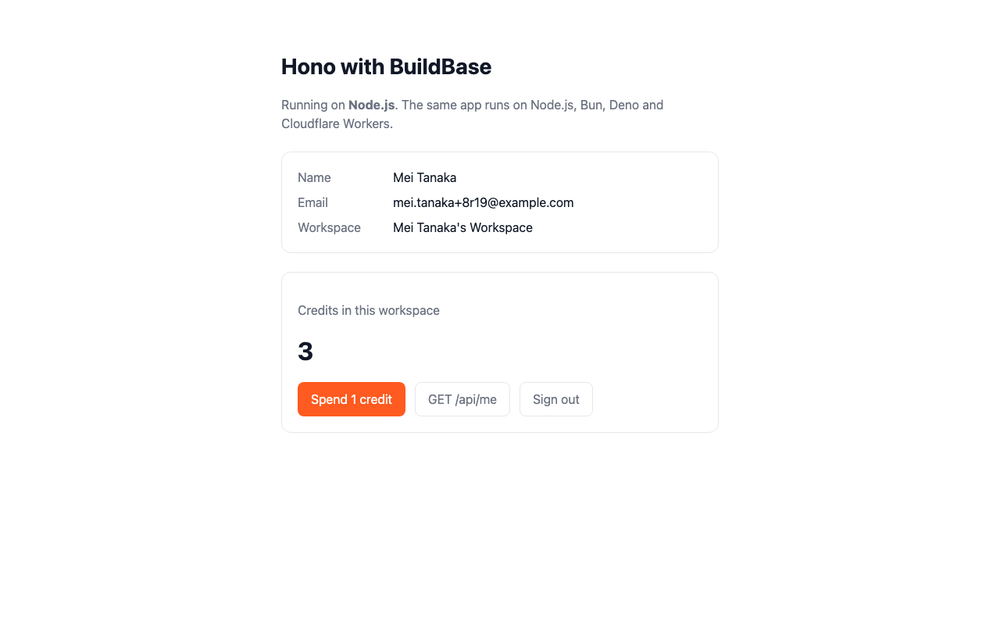
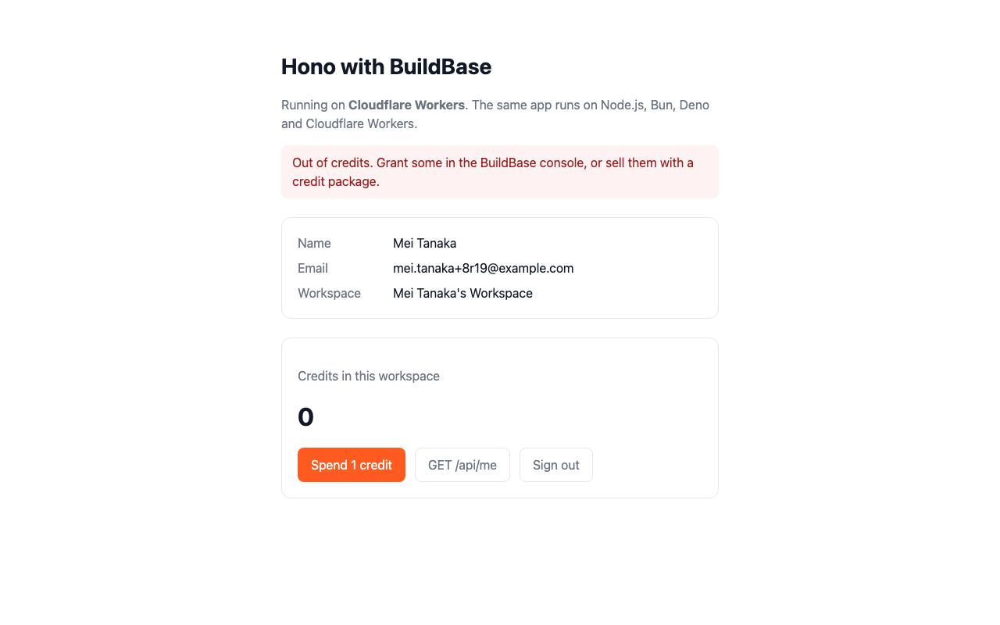

# Hono with BuildBase

One [Hono](https://hono.dev) app with [BuildBase](https://buildbase.app) sign-in and credits that runs, unchanged, on **Node.js, Bun, Deno and Cloudflare Workers**. It is the example for **Hono**, and for **BuildBase outside Node**: the server SDK uses only `fetch` and other Web APIs, so it goes wherever Hono goes.

Sign in on BuildBase's hosted page, see your profile, workspace and credit balance, and spend a credit from a form or from a JSON endpoint that answers 402 when the workspace is empty. There is no database: the session is a signed cookie, so it works the same in a Worker as in a long-running server.

## See it working

**Sign in once, then spend a credit on each runtime until the workspace runs dry.**


1. On Node.js, **Sign in with BuildBase** goes to the hosted page; sign up there. Back in the app: the profile, the workspace BuildBase created, and its 3 starting credits.
2. **Spend 1 credit** on Node.js: 2 left. The same page on Bun: 1 left. On Deno: 0 left.
3. On Cloudflare Workers (`wrangler dev`, in workerd): **Out of credits**. `GET /api/me` reports `"runtime": "workerd"`.
4. **Sign out** ends the BuildBase session, not only the cookie.

<table><tr><td width="33%"></td><td width="33%"></td><td width="33%"></td></tr><tr><td align="center"><sub>Signed out</sub></td><td align="center"><sub>Signed in on Node.js</sub></td><td align="center"><sub>Out of credits on Workers</sub></td></tr></table>

The four servers ran side by side against a local BuildBase stack, with one `.env`. The session carries across because localhost shares cookies between ports and all four sign with the same `COOKIE_SECRET`; in production each deployment has its own domain. Separately, each runtime was signed in on its own through the hosted page (sign-up on Node.js, a magic link on the others) and spent through `POST /api/spend`. Node's spend came before the sign-up grant landed and answered 402; Bun, Deno and Workers then took the 3 credits to 0. Still stretches are shortened. [Watch it as an MP4](../.github/media/hono.mp4).

## How it works

About 400 lines in `src`:

| File | What it does |
| --- | --- |
| [`app.tsx`](src/app.tsx) | The whole app: routes, and the pages in `hono/jsx` |
| [`buildbase.ts`](src/buildbase.ts) | Everything it asks of BuildBase, behind a small interface |
| `node.ts`, `bun.ts`, `deno.ts`, `worker.ts` | One per runtime. Each only hands `createApp()` to that runtime's server |

- **Sign-in.** `GET /auth/sign-in` keeps a random `state` in a signed cookie and redirects to the URL from `AuthApi.requestAuth()`. BuildBase returns to `GET /auth/callback` with a one-time `code`; the server checks `state`, exchanges the code with the client secret for a BuildBase session ID, and keeps that in a signed, httpOnly cookie.
- **Config.** `env()` from `hono/adapter` reads `process.env`, `Bun.env`, `Deno.env` or the Worker's bindings, whichever applies. The SDK client is made on first use, since a Worker only sees its env inside a request.
- **Every page** reads the account with the server SDK: `withSession(id)`, then `users.getProfile()`, `workspace.list()` and `credits.getBalance()`. A session BuildBase has revoked comes back 401, and the app treats it as signed out.
- **Spending.** `POST /credits/spend` (the form) and `POST /api/spend` (JSON) call `credits.consume()`. The form carries an idempotency key minted when the page rendered, and the API takes an `Idempotency-Key` header, so a retried request is charged once.
- **CSRF.** Hono's `csrf()` refuses cross-site form posts, including a POST with no content type. API callers send JSON.

## Set up BuildBase (about 10 minutes)

1. Create an organization at [console.buildbase.app](https://console.buildbase.app) and copy its ID from **Settings → General**.
2. Under **User Management → Authentication**, create an auth client and copy its client ID and secret. The secret is shown once.
3. On that client, register `<where the app runs>/auth/callback` as a redirect URL for each place you run it: `http://localhost:3000/auth/callback` for Node, Bun and Deno, and `http://localhost:8787/auth/callback` for `wrangler dev`. They must match exactly.
4. Enable at least one sign-in method, for example Email (magic link).
5. For starting credits, add a workflow: **Workspace Created → Grant Credits** (the demo grants 3), and publish it.

```bash
npm install
cp .env.example .env              # the BUILDBASE_* values, and COOKIE_SECRET=$(openssl rand -hex 32)

npm run dev                       # Node.js, http://localhost:3000
npm run dev:bun                   # Bun
npm run dev:deno                  # Deno 2, which reads package.json and node_modules
cp .dev.vars.example .dev.vars    # the same values, for Workers
npm run dev:workers               # Cloudflare Workers in workerd, http://localhost:8787
```

| Variable | What it is |
| --- | --- |
| `BUILDBASE_ORG_ID` | Your org ID |
| `BUILDBASE_CLIENT_ID` / `BUILDBASE_CLIENT_SECRET` | The auth client. The secret stays on the server |
| `COOKIE_SECRET` | Signs the session cookies |
| `APP_URL` | Optional. Where the app is served, if not the request's origin (behind a proxy, say) |
| `BUILDBASE_SERVER_URL` | Optional; defaults to `https://api.console.buildbase.app` |

Until the four required values are set, the page lists the missing ones and sign-in answers 503.

## Deploy

- **Node.js**: `npm run build && npm start`, anywhere Node 22+ runs. It reads `.env` when there is one, and the environment otherwise.
- **Bun** and **Deno**: run `src/bun.ts` or `src/deno.ts` as above; both run TypeScript and JSX directly.
- **Cloudflare Workers**: `npx wrangler secret put BUILDBASE_CLIENT_SECRET` and `COOKIE_SECRET`, put the org and client IDs under `vars` in [`wrangler.jsonc`](wrangler.jsonc), then `npm run deploy:workers`. The bundle is about 160 KiB, 39 KiB gzipped. Register the `workers.dev` URL's `/auth/callback` on the auth client.

## Good to know

- **Tests.** `npm test` runs the routes under Node against a fake BuildBase: the state check, forged and revoked sessions, the CSRF guard, idempotent spending and the 402. CI also builds the Worker bundle with `wrangler deploy --dry-run`. The Bun and Deno runs were checked by hand against a local BuildBase, as the recording shows.
- **The session is BuildBase's.** The cookie holds the BuildBase session ID, signed so it cannot be forged, and every page asks BuildBase about it. There is no user table; add one keyed on the BuildBase user ID if your app needs its own data per user.
- **Rate limit.** BuildBase accepts 30 credit-spend requests a minute per IP. Workers and other serverless platforms can share outgoing IPs, which is fine for a demo and worth knowing before production traffic.

## License

MIT. Our own code, in the shape of Hono's starter templates.
