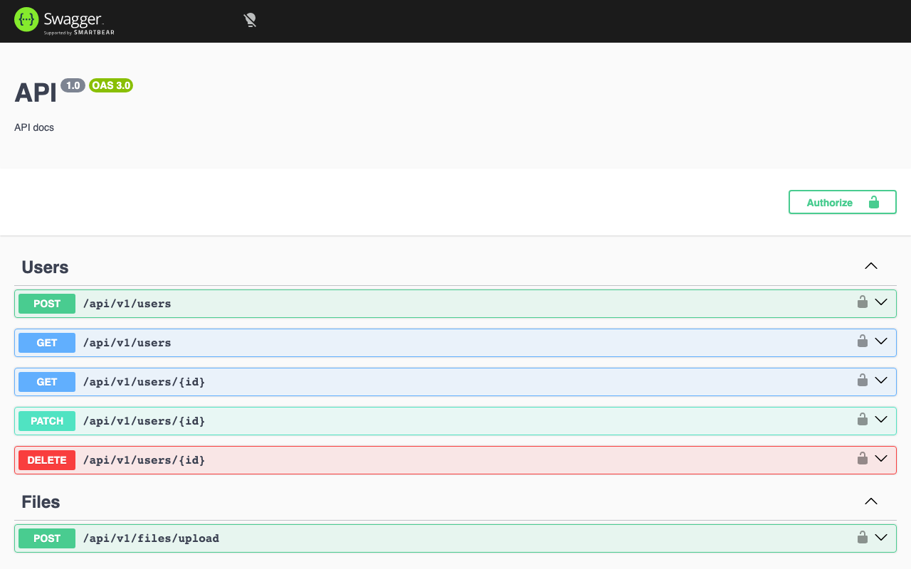
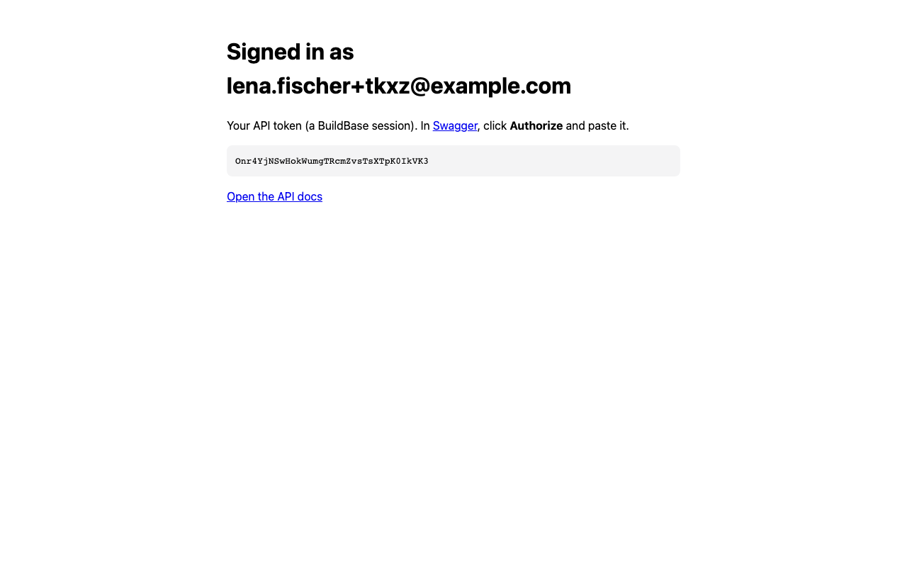
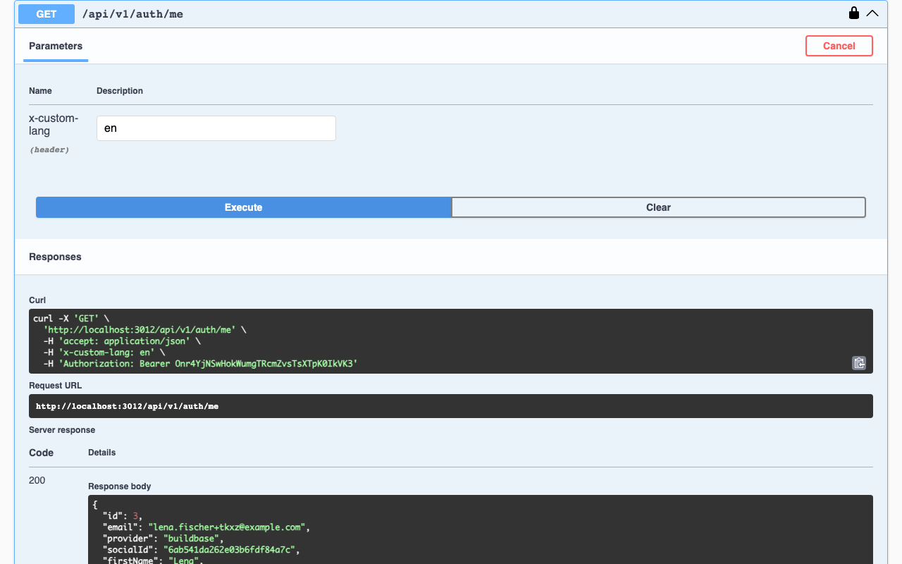

# NestJS Boilerplate with BuildBase

[NestJS Boilerplate](https://github.com/brocoders/nestjs-boilerplate) (4.4k★) is a REST API with users, roles, file uploads, i18n, Swagger and a choice of Postgres (TypeORM) or MongoDB (Mongoose). Here its authentication is replaced by [BuildBase](https://buildbase.app). It is the example for **NestJS**, and for **an API with no UI of its own**.

| Upstream builds itself                                             | Here, BuildBase does it                                                                                                                  |
| ------------------------------------------------------------------ | ---------------------------------------------------------------------------------------------------------------------------------------- |
| Email register, confirm, login, forgot and reset password (bcrypt) | The hosted sign-in page: email, magic link, social, passkeys, as the org enables them                                                    |
| JWT access tokens, refresh tokens and a `session` table            | The token is a BuildBase session ID; BuildBase manages its lifetime                                                                      |
| Apple, Facebook and Google login modules                           | Social sign-in on the hosted page                                                                                                        |
| Passport's `AuthGuard('jwt')`                                      | `BuildBaseAuthGuard`, which puts the same `{ id, role }` on the request, so `RolesGuard`'s logic is unchanged (only a type import moved) |
| Confirmation and reset emails (`mail`, `mailer`, maildev)          | BuildBase sends sign-in email                                                                                                            |

About 2,000 lines of `src` are gone, and `@nestjs/jwt`, `@nestjs/passport`, `passport`, `passport-jwt`, `passport-anonymous`, `bcryptjs`, `apple-signin-auth`, `google-auth-library`, `nodemailer`, `handlebars` and `ms` with them; `@buildbase/sdk` is in. One migration drops the `session` table and the password column. Users, roles, statuses, files, i18n, both database layers and the code generators are upstream's.

## See it working

**Sign in through BuildBase, then call the API from its own Swagger docs.**


1. Swagger at `/docs` lists the BuildBase auth endpoints.
2. `GET /api/v1/auth/buildbase/url` gives the hosted sign-in page; sign up there.
3. In development, the callback page shows the API token.
4. **Authorize** in Swagger with it, and `GET /api/v1/auth/me` returns the user: `provider: "buildbase"`, with the BuildBase user ID as `socialId`.
5. `POST /api/v1/auth/logout` ends the BuildBase session; the same token is refused (401) right after.

<table><tr><td width="33%"></td><td width="33%"></td><td width="33%"></td></tr><tr><td align="center"><sub>Swagger</sub></td><td align="center"><sub>The API token</sub></td><td align="center"><sub>GET /auth/me</sub></td></tr></table>

Recorded against a local BuildBase stack on Postgres; still stretches are shortened. [Watch it as an MP4](../.github/media/nestjs-boilerplate-api.mp4).

## How sign-in works here

An API has no pages, so the client drives it. Upstream's `POST /auth/email/login` becomes:

1. **`GET /api/v1/auth/buildbase/url?redirect=<your page>`** returns `{ url }`, BuildBase's hosted sign-in page. Send the person there.
2. The hosted page returns to your page with `?code=`. Post it to **`POST /api/v1/auth/buildbase/login`** `{ code }`.
3. The API exchanges the code with the client secret, finds the user by BuildBase ID (the way upstream's social login used `socialId`), adopts one with the same email, or creates one with the `user` role. It answers `{ token, user }`.
4. Send `Authorization: Bearer <token>` from then on. **`BuildBaseAuthGuard`** asks BuildBase who the session belongs to (cached for a minute) and sets `request.user` to `{ id, role, sessionId }`. The server SDK is bound per request with `withSession()`, since Nest has no async request context.

There is no refresh token: the token is the BuildBase session, which BuildBase keeps alive and ends on logout. `GET /api/v1/auth/buildbase/callback` is a development convenience that does steps 2 and 3 and shows the token, for trying the API in Swagger; it answers 404 in production.

## Set up BuildBase (about 10 minutes)

1. Create an organization at [console.buildbase.app](https://console.buildbase.app) and copy its ID from **Settings → General**.
2. Under **User Management → Authentication**, create an auth client and copy its client ID and secret. The secret is shown once.
3. On that client, register your frontend's callback URL, and `http://localhost:3001/api/v1/auth/buildbase/callback` for Swagger in development.
4. Enable at least one sign-in method, for example Email (magic link).

```bash
cp env-example-relational .env   # set the BUILDBASE_* values and your database
npm install
npm run migration:run && npm run seed:run:relational
npm run start:dev                # Swagger at http://localhost:3001/docs
```

| Variable                                          | What it is                                                |
| ------------------------------------------------- | --------------------------------------------------------- |
| `BUILDBASE_ORG_ID`                                | Your org ID                                               |
| `BUILDBASE_CLIENT_ID` / `BUILDBASE_CLIENT_SECRET` | The auth client. The secret stays on the server           |
| `BUILDBASE_SERVER_URL`                            | Optional; defaults to `https://api.console.buildbase.app` |

Until the org, client ID and secret are set, sign-in answers 503. The database, file storage and deployment settings are upstream's; see its [docs](docs) and [README](https://github.com/brocoders/nestjs-boilerplate/blob/9620f159eefe38f47747d02ab162852367c5472c/README.md).

## Good to know

- **Admin rights come from this app's roles.** A seeded `admin@example.com` is adopted, role and all, when someone with that email first signs in through BuildBase.
- **Email and password are not editable here.** `PATCH /auth/me` changes the app's profile fields; the sign-in email belongs to the BuildBase account.
- **`DELETE /auth/me` deletes this app's data** and ends the session. The BuildBase account stays.
- **Tests:** upstream's end-to-end suites signed in with email and password against Docker, so they are removed. `npm test` runs unit tests for the guard and the sign-in rules, with no database or network.
- **No git hooks.** Upstream installs husky from `npm install`; in a folder of a shared examples repo they would land on the whole repo, so they are removed.

## License

MIT, like the upstream it is based on. The original copyright notice is kept in [LICENSE](LICENSE). Based on [brocoders/nestjs-boilerplate](https://github.com/brocoders/nestjs-boilerplate) at `9620f15`; modified and added files say so at the top.
