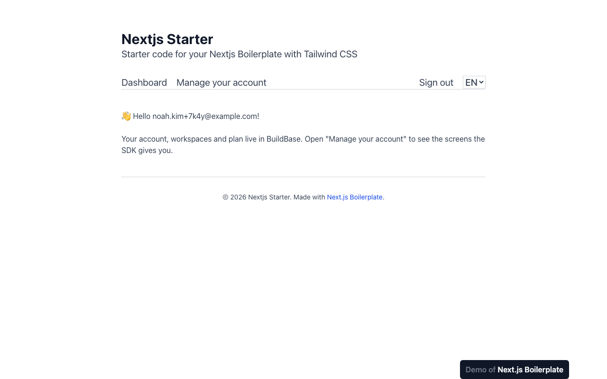
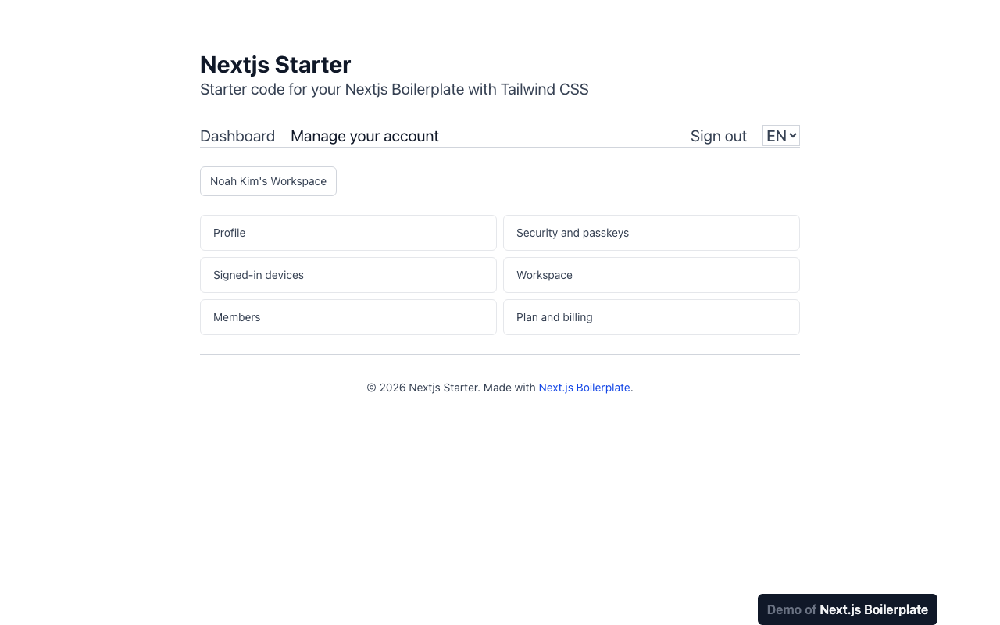
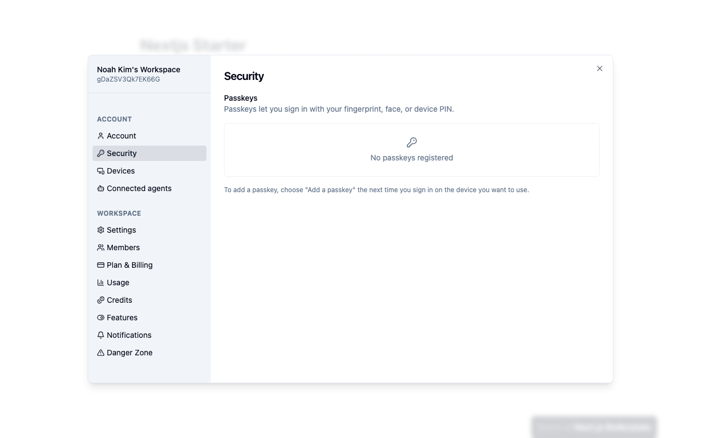

# Next.js Boilerplate with BuildBase

[Next.js Boilerplate](https://github.com/ixartz/Next-js-Boilerplate) (13k★) with Clerk swapped out for [BuildBase](https://buildbase.app). Everything else is upstream's: next-intl (English and French), Drizzle with PGlite, Arcjet, Sentry, PostHog, Vitest, Playwright, Storybook and the lint setup. It is the same swap you would make in your own Clerk app, done once so you can read the diff.

| Clerk in upstream | BuildBase here |
| --- | --- |
| `clerkMiddleware` guarding `/dashboard` in `src/proxy.ts` | A `bb-session` cookie check in the same file; Arcjet and i18n routing are untouched |
| `<ClerkProvider>` with a localization map | `<BuildBaseProvider>` (`src/components/BuildBaseProvider.tsx`) |
| `<SignIn />` and `<SignUp />` | One button to the hosted page, which does both (email, magic link, Google, GitHub, passkeys, whatever you enable) |
| `<UserProfile />` | BuildBase's Profile, Security, Devices, Workspace, Members and Plan screens, opened from `/dashboard/user-profile` |
| `<SignOutButton />` | `useSaaSAuth().signOut` |
| `currentUser()` on the server | `bb().users.getProfile()`, which also validates the session |
| - | Workspaces: every user gets one on first sign-in, with members, roles and a plan |

Two dependencies out (`@clerk/nextjs`, `@clerk/localizations`), one in (`@buildbase/sdk`). Lint, types, knip, the i18n check and the unit tests pass with upstream's own strict config.

## See it working

**The Clerk-shaped flow, running on BuildBase.**


1. The landing page is upstream's. `/dashboard` redirects to sign-in.
2. Sign up on the hosted page. The dashboard greets the email it read on the server.
3. **Manage your account** replaces Clerk's `<UserProfile />`: each button opens an SDK screen, such as security and passkeys.
4. The same dashboard in French: upstream's i18n is untouched.

<table><tr><td width="33%"></td><td width="33%"></td><td width="33%"></td></tr><tr><td align="center"><sub>Dashboard, user read on the server</sub></td><td align="center"><sub>Account page</sub></td><td align="center"><sub>SDK security screen</sub></td></tr></table>

Recorded against a local BuildBase stack; still stretches are shortened. [Watch it as an MP4](../.github/media/nextjs-boilerplate.mp4).

## Deploy

[](https://vercel.com/new/clone?repository-url=https%3A%2F%2Fgithub.com%2Fbuildbase-app%2Fexamples&root-directory=nextjs-boilerplate&project-name=nextjs-boilerplate-buildbase&env=NEXT_PUBLIC_BUILDBASE_ORG_ID,NEXT_PUBLIC_BUILDBASE_CLIENT_ID,BUILDBASE_CLIENT_SECRET,NEXT_PUBLIC_BUILDBASE_REDIRECT_URL,DATABASE_URL&envDescription=Your%20org%20and%20auth%20client%20from%20the%20BuildBase%20console%2C%20and%20a%20Postgres%20URL&envLink=https%3A%2F%2Fgithub.com%2Fbuildbase-app%2Fexamples%2Ftree%2Fmain%2Fnextjs-boilerplate%23set-up-buildbase)

`npm run build` runs the Drizzle migrations first, as upstream does, so a deployment needs a real Postgres `DATABASE_URL` (Neon, Supabase, Vercel Postgres). Locally, `npm run dev` starts PGlite for you.

## Set up BuildBase (about 10 minutes)

1. Create an organization at [console.buildbase.app](https://console.buildbase.app) and copy its ID from **Settings → General**.
2. Under **User Management → Authentication**, create an auth client and copy its client ID and secret. The secret is shown once.
3. On that client, register the redirect URL `http://localhost:3000/sign-in`, and your deployed `https://<domain>/sign-in`. Wildcards like `*.vercel.app` are not accepted.
4. Enable at least one sign-in method, for example Email (magic link), which also turns on email/password sign-up.
5. Under workspace settings, choose the **Platform** mode with **auto-create first workspace** on, so each user lands with a workspace.

```bash
cp .env.example .env.local   # fill in the values from steps 1-3
npm install
npm run dev
```

| Variable | What it is |
| --- | --- |
| `NEXT_PUBLIC_BUILDBASE_ORG_ID` | Your org ID |
| `NEXT_PUBLIC_BUILDBASE_CLIENT_ID` / `BUILDBASE_CLIENT_SECRET` | The auth client. The secret is **server only** |
| `NEXT_PUBLIC_BUILDBASE_REDIRECT_URL` | The exact `/sign-in` URL from step 3 |
| `NEXT_PUBLIC_BUILDBASE_SERVER_URL` | Optional; defaults to `https://api.console.buildbase.app` |

Until the org and client are set, the sign-in and dashboard pages show these steps instead of failing.

## Where things live

- **`src/components/BuildBaseProvider.tsx`**: the SDK provider, and a loader that selects the user's first workspace (the SDK fetches the list only when asked).
- **`src/app/api/auth/*`**: exchanges the sign-in code for a session in an httpOnly `bb-session` cookie. The client secret never reaches the browser.
- **`src/libs/BuildBase.ts`**: the server-side client. `src/components/Hello.tsx` uses it to read the user on the dashboard.
- **`src/components/AccountPanel.tsx`**: the workspace switcher and the buttons that open each SDK screen.
- **`src/proxy.ts`**: sends signed-out visitors from `/dashboard` (in any locale) to `/sign-in`.

## Good to know

- **One redirect URL.** The hosted page returns to `NEXT_PUBLIC_BUILDBASE_REDIRECT_URL`, so a French visitor comes back to `/sign-in` and continues from there. Register the `/fr/` URLs too if you point the redirect at them.
- **The SDK screens are in English.** The app's own pages keep upstream's translations.
- **The homepage sponsor list is upstream's** and still includes Clerk. It is ixartz's, so it stays.
- **No git hooks or upstream CI.** Upstream installs lefthook hooks on `npm install` and ships its own `.github` workflows; in a folder of a shared examples repo the hooks would land on the whole repo and the workflows would never run, so both are removed. The examples repo has its own CI.
- Everything else (Sentry, Arcjet, PostHog, Crowdin, the tests, Storybook) works as the [upstream README](https://github.com/ixartz/Next-js-Boilerplate/blob/9df22d0980702729da01c4465b9fb8ca292d6cce/README.md) describes.

## License

MIT, like the upstream it is based on. The original copyright notice is kept in [LICENSE](LICENSE). Based on [ixartz/Next-js-Boilerplate](https://github.com/ixartz/Next-js-Boilerplate) at `9df22d0`; modified and added files say so at the top.
