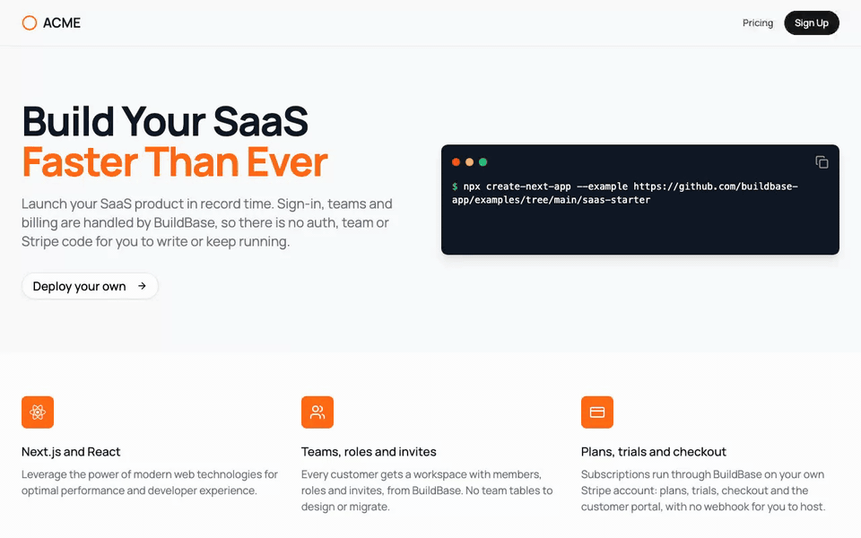
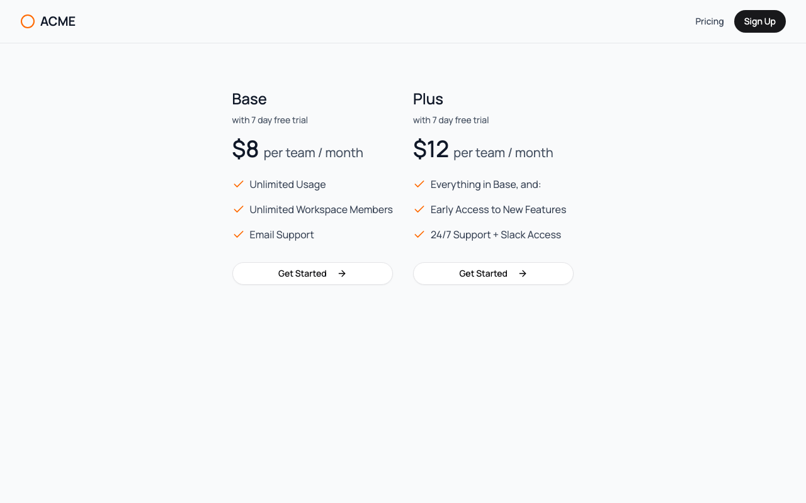
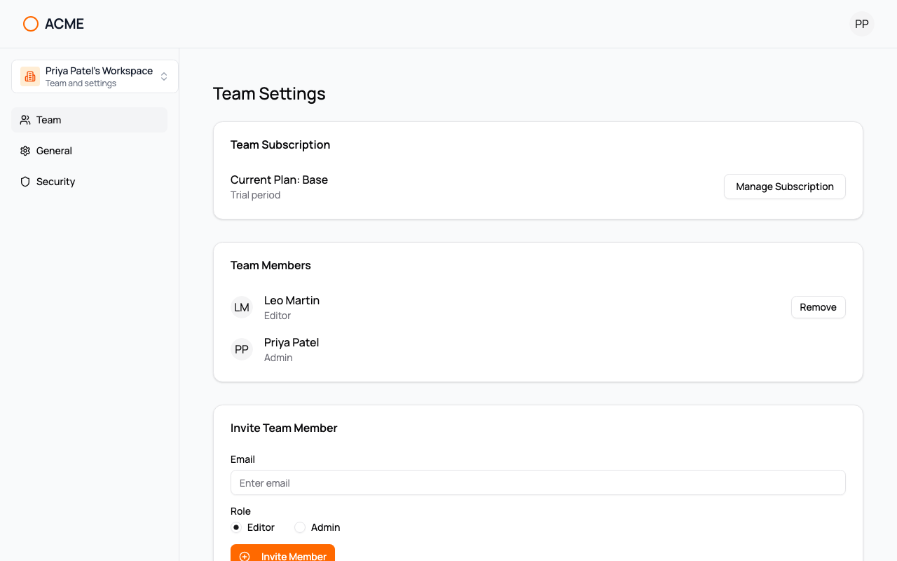

# Next.js SaaS Starter with BuildBase

[Next.js SaaS Starter](https://github.com/nextjs/saas-starter) (16k★), with its hand-built auth, teams and Stripe code replaced by [BuildBase](https://buildbase.app). The pages, the design and the dashboard are the same. What is gone is the plumbing:

| Upstream builds itself | Here, BuildBase does it |
| --- | --- |
| Email/password auth with bcrypt and JWT cookies (`jose`) | Hosted sign-in: email, magic link, Google, GitHub, passkeys, whatever you enable |
| `teams`, `team_members`, `invitations` and `activity_logs` tables in Postgres | Workspaces with members and roles (admin, editor, viewer) |
| Stripe Checkout, the customer portal, and a webhook route to keep the DB in sync | Plans, trials and checkout on your own Stripe account, with no webhook in this app |
| Account and password-change forms | BuildBase's prebuilt Profile, Security and Devices screens |

**No database.** The Postgres, Drizzle and migration setup is gone, along with `bcryptjs`, `jose`, `stripe`, `swr` and `zod`. The TypeScript in `app/`, `components/` and `lib/` went from 3,586 lines to 1,773.

## See it working

**Pricing, sign-up, a teammate, and a trial through Stripe Checkout.**



1. The pricing page reads the Base and Plus plans from BuildBase: $8 and $12 a month, with a 7-day trial.
2. Sign up on the hosted page and land on the team dashboard.
3. Add a teammate who already has an account, as an editor.
4. **Get Started** opens Stripe Checkout in test mode. The trial needs no card, and the team is on Base when it comes back.

<table><tr><td width="33%"></td><td width="33%"></td><td width="33%"></td></tr><tr><td align="center"><sub>Plans from BuildBase</sub></td><td align="center"><sub>The team</sub></td><td align="center"><sub>On the plan, trialing</sub></td></tr></table>

Recorded against a local BuildBase stack with Stripe in test mode; still stretches are shortened. [Watch it as an MP4](../.github/media/saas-starter.mp4).

## Deploy

[](https://vercel.com/new/clone?repository-url=https%3A%2F%2Fgithub.com%2Fbuildbase-app%2Fexamples&root-directory=saas-starter&project-name=saas-starter-buildbase&env=NEXT_PUBLIC_BUILDBASE_ORG_ID,NEXT_PUBLIC_BUILDBASE_CLIENT_ID,BUILDBASE_CLIENT_SECRET,NEXT_PUBLIC_BUILDBASE_REDIRECT_URL&envDescription=Your%20org%20and%20auth%20client%20from%20the%20BuildBase%20console&envLink=https%3A%2F%2Fgithub.com%2Fbuildbase-app%2Fexamples%2Ftree%2Fmain%2Fsaas-starter%23set-up-buildbase)

## Set up BuildBase (15-20 minutes)

**Sign-in**

1. Create an organization at [console.buildbase.app](https://console.buildbase.app) and copy its ID from **Settings → General**.
2. Under **User Management → Authentication**, create an auth client and copy its client ID and secret. The secret is shown once.
3. On that client, register the redirect URL `http://localhost:3000/sign-in`, and your deployed `https://<domain>/sign-in`. Wildcards like `*.vercel.app` are not accepted.
4. Enable at least one sign-in method, for example Email (magic link), which also turns on email/password sign-up.

**Teams**

5. Under workspace settings, choose the **Platform** mode with **auto-create first workspace** on and **members can be invited**. Each customer then gets a workspace (their team) the first time they sign in.

**Billing**

6. Connect Stripe (test keys are fine) under **Billing → Credentials**.
7. Create two plans, **Base** and **Plus**, with a monthly price and a 7-day trial. Add at least one item, such as a "Team members" limit, and publish them.
8. Create a pricing group with the slug `pricing`, add both plans, and publish it. The `/pricing` page reads this group.

**Environment**

```bash
cp .env.example .env.local
pnpm install
pnpm dev
```

| Variable | What it is |
| --- | --- |
| `NEXT_PUBLIC_BUILDBASE_ORG_ID` | Your org ID |
| `NEXT_PUBLIC_BUILDBASE_CLIENT_ID` / `BUILDBASE_CLIENT_SECRET` | The auth client. The secret is **server only** |
| `NEXT_PUBLIC_BUILDBASE_REDIRECT_URL` | The exact `/sign-in` URL from step 3 |
| `NEXT_PUBLIC_BUILDBASE_PRICING_GROUP` | Optional; defaults to `pricing` |
| `NEXT_PUBLIC_BUILDBASE_SERVER_URL` | Optional; defaults to `https://api.console.buildbase.app` |

## Where things live

- **`components/buildbase-provider.tsx`**: the SDK provider, and a loader that fetches and selects the user's workspace (the SDK fetches the list only when asked).
- **`app/api/auth/*`**: exchanges the sign-in code for a session in an httpOnly `bb-session` cookie. The client secret never reaches the browser.
- **`app/(dashboard)/dashboard/page.tsx`**: the team. `useSubscription` gives the plan; `getUsers`, `addUser` and `removeUser` manage members. **Manage Subscription** opens BuildBase's own subscription screen.
- **`app/(dashboard)/pricing/page.tsx`**: `usePublicPlans('pricing')` for the cards, and `useCreateCheckoutSession` for **Get Started**.
- **`middleware.ts`**: sends signed-out visitors from `/dashboard` to `/sign-in`.

## Good to know

- **Adding a member needs an existing account.** `addUser` adds someone who has already signed up; for anyone else it answers "ask them to sign up first". Email invitations for new people are not in the published SDK yet.
- **Plan prices are in cents** in the BuildBase API (`800` is $8). The console handles this for you; it only matters if you create plans through the API.
- **The feature bullets** on the pricing cards are hardcoded per plan name, as upstream had them. The prices and trial length come from BuildBase.

## License

MIT, like the upstream it is based on. The original copyright notice is kept in [LICENSE](LICENSE). Based on [nextjs/saas-starter](https://github.com/nextjs/saas-starter) at `6e33e58`; modified files say so at the top.
