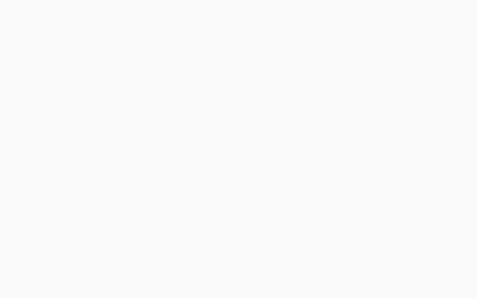
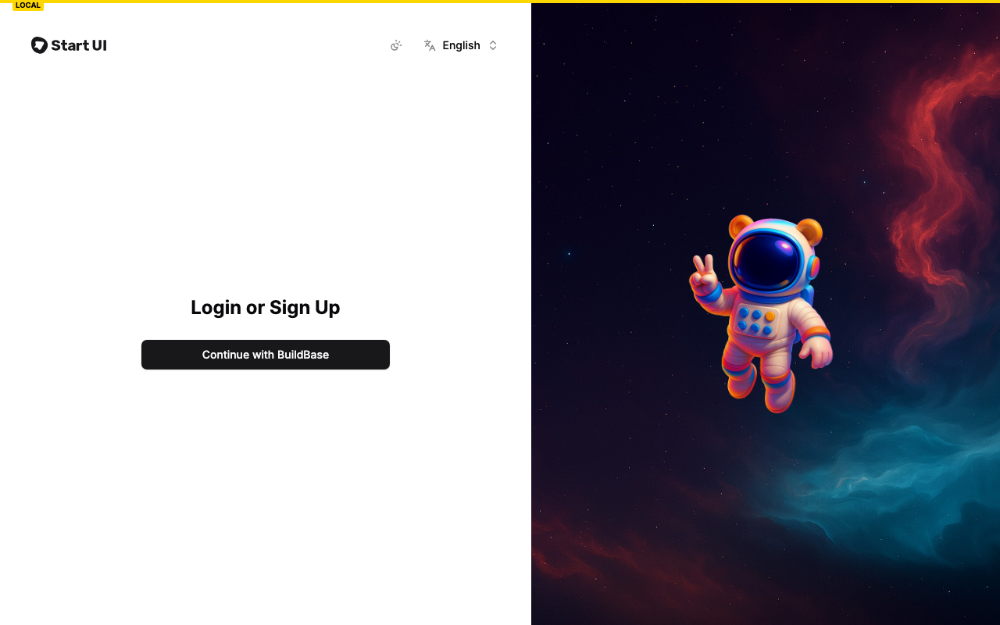
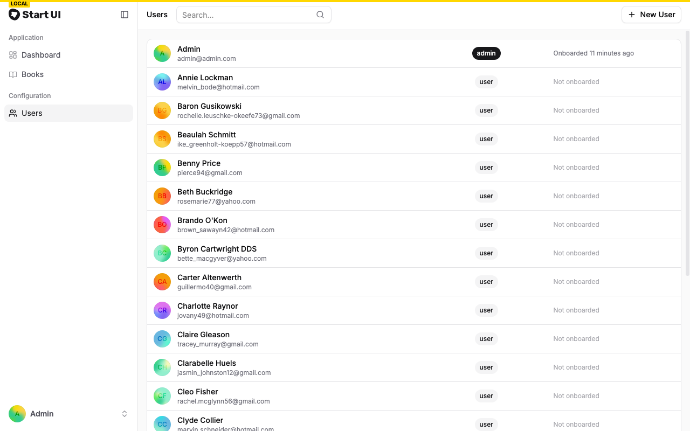
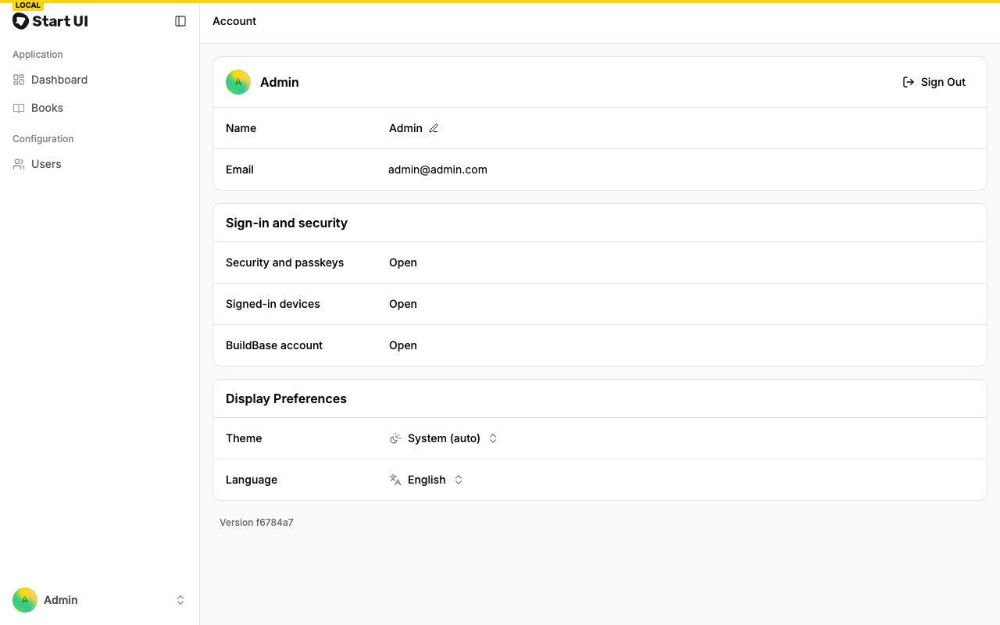

# Start UI [web] with BuildBase

[Start UI [web]](https://github.com/BearStudio/start-ui-web) (1.7k★) is BearStudio's opinionated starter on **TanStack Start**, with better-auth, oRPC, Prisma, an admin area and i18n. Here [BuildBase](https://buildbase.app) becomes its way in. It is the example for **TanStack Start**, and for **adding BuildBase to an app that already uses an auth library**.

| Upstream | Here |
| --- | --- |
| Email one-time code (better-auth `emailOTP`), with a code-entry page and a login email | BuildBase's hosted page: email, magic link, social, passkeys, 2FA, as the org enables them |
| GitHub OAuth | Social sign-in on the hosted page |
| better-auth sessions, admin plugin, roles and permissions | **Unchanged.** A small better-auth plugin makes BuildBase a sign-in method, so the session, the admin screens and every oRPC permission check work as before |
| - | The BuildBase React SDK's Security, Devices and Account screens, on the account page |

Only about 400 lines are added and 670 removed. `react-email` and `nodemailer` go, with the login email, the `/login/verify` route and the mail server in Docker; `@buildbase/sdk` is in. Books, the manager, users administration, oRPC, uploads and i18n are upstream's.

## See it working

**A returning admin signs in with a magic link and lands back on the users page.**



1. Opening `/manager/users` signed out goes to the login page: one button to BuildBase.
2. On the hosted page the admin asks for a magic link and follows it from the email.
3. They land back on **Users**, better-auth's admin screen, unchanged; their role came with them.
4. The account page has a **Sign-in and security** card: each row opens the SDK's own screen.
5. **Sign Out** ends both the better-auth session and the BuildBase one; the manager asks for sign-in again.

The admin is the one upstream seeds: `admin@admin.com` was adopted by email the first time it signed in through BuildBase.

<table><tr><td width="33%"></td><td width="33%"></td><td width="33%"></td></tr><tr><td align="center"><sub>Login: one button</sub></td><td align="center"><sub>Users, better-auth's admin screen</sub></td><td align="center"><sub>The Sign-in and security card</sub></td></tr></table>

Recorded against a local BuildBase stack; still stretches are shortened. [Watch it as an MP4](../.github/media/start-ui-web.mp4).

## How sign-in works here

`src/server/buildbase-auth.ts` is a better-auth plugin with two endpoints:

1. **`GET /api/auth/buildbase/sign-in?redirectTo=`** stores a random `state` and the landing page in a cookie signed with better-auth's secret, asks `AuthApi.requestAuth()` for the hosted page URL, and redirects there.
2. **`GET /api/auth/buildbase/callback`** checks `state`, exchanges the code with the client secret, and reads the user with the server SDK's `withSession()`. Then, through better-auth's own adapter, it does what a social login does:
   - finds the user by their `buildbase` account (`findAccountOwnerByKey`),
   - or adopts one with the same email (`linkAccount`),
   - or creates one (`createOAuthUser`), already onboarded, since BuildBase knows the name.

   It opens a better-auth session with the BuildBase session ID beside it (`createSession`), sets the cookie (`setSessionCookie`), and redirects back.
3. A `before` hook on `/sign-out` ends the BuildBase session too.

The React SDK is only there for its account screens. `src/features/auth/buildbase-provider.tsx` mounts `SaaSOSProvider` and gets the BuildBase session from better-auth's `getSession()`, which carries the plugin's `buildbaseSessionId` field.

## Set up BuildBase (about 10 minutes)

1. Create an organization at [console.buildbase.app](https://console.buildbase.app) and copy its ID from **Settings → General**.
2. Under **User Management → Authentication**, create an auth client and copy its client ID and secret. The secret is shown once.
3. On that client, register `http://localhost:3000/api/auth/buildbase/callback`, and the same path on your deployed domain.
4. Enable at least one sign-in method, for example Email (magic link).
5. Under workspace settings, check that **Auto-Create First Workspace** (under **Advanced Overrides**) is on; it is by default; the account screens open for a workspace.

```bash
cp .env.example .env     # set the four BuildBase values
pnpm install
pnpm dk:init             # Postgres and S3 in Docker (upstream's setup)
pnpm db:init             # schema and seed data
pnpm dev
```

| Variable | What it is |
| --- | --- |
| `VITE_BUILDBASE_ORG_ID` / `VITE_BUILDBASE_CLIENT_ID` | Your org and auth client. Public: the browser's React SDK uses them |
| `BUILDBASE_CLIENT_SECRET` | The client secret. Server only |
| `VITE_BUILDBASE_SERVER_URL` | Optional; defaults to `https://api.console.buildbase.app` |

Until they are set, the login button is disabled and the page says why. Everything else (S3, the admin area, Storybook, the tests) is upstream's; see its [README](https://github.com/BearStudio/start-ui-web/blob/7a4e236f6ac3ac341c6ef1802ea6c8c7bbc585d9/README.md). Node 22 or later.

## Good to know

- **Why keep better-auth?** It already holds the sessions, the admin plugin and the permission checks this app is built on. Swapping only the sign-in keeps all of that, which is often the shape of adding BuildBase to an existing app.
- **Seeded users are adopted by email.** `admin@admin.com` gets its admin role the first time someone with that email signs in through BuildBase.
- **The React SDK forgets where it was.** It remembers a signed-out page to return to after sign-in, which would undo the server's own redirect, so the provider clears it before starting.
- **Tests:** upstream's 103 unit and 47 browser tests pass. Its Playwright suites that logged in with the mocked email code are removed; the API-schema one stays.
- **No git hooks.** Upstream installs lefthook from `pnpm install`; in a folder of a shared examples repo they would land on the whole repo, so they are removed.

## License

MIT, like the upstream it is based on. The original copyright notice is kept in [LICENSE](LICENSE). Based on [BearStudio/start-ui-web](https://github.com/BearStudio/start-ui-web) at `7a4e236`; modified and added files say so at the top.
