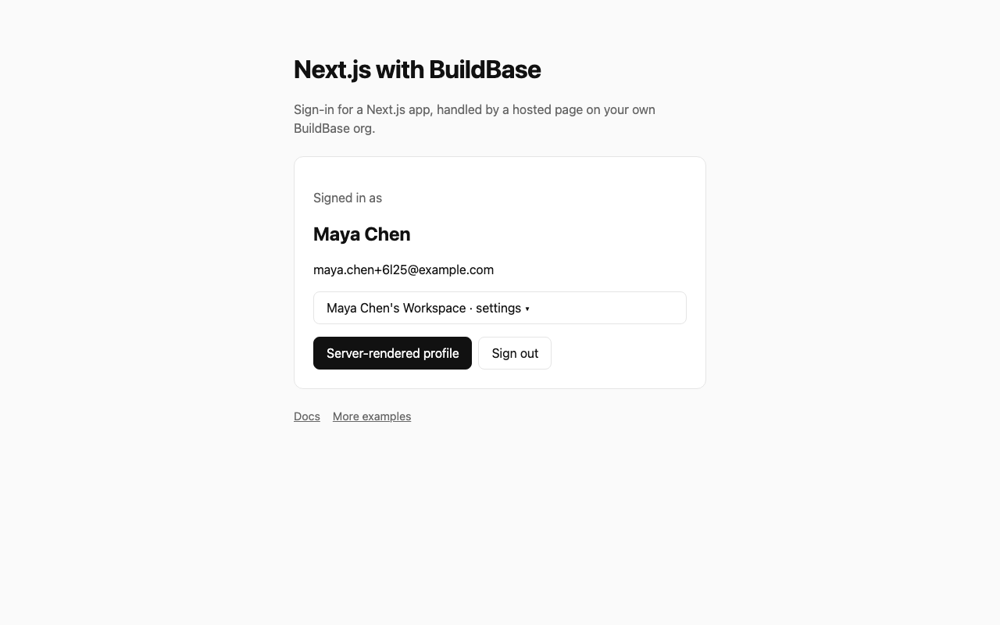
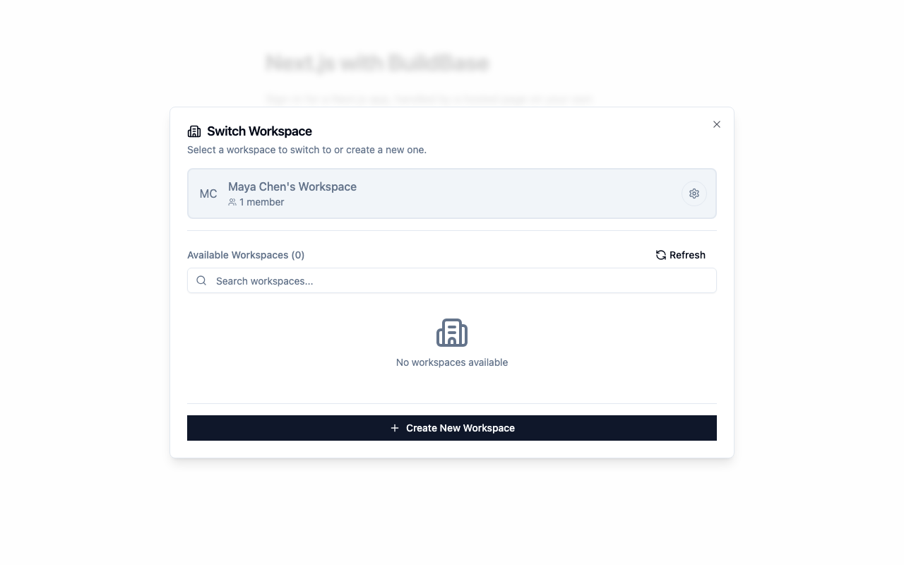
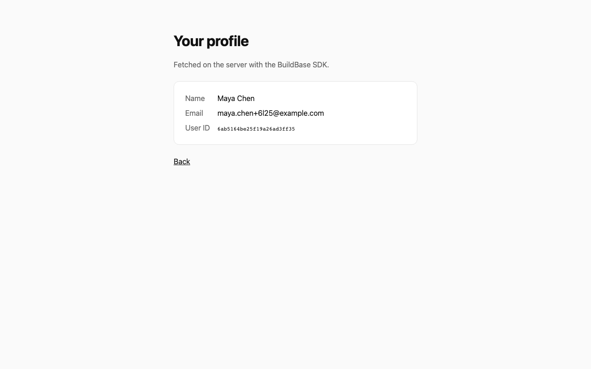

# Next.js with BuildBase

Sign-in for a Next.js app, using [BuildBase](https://buildbase.app). This is the smallest working integration. You get a hosted sign-in page on your own org, a session kept in an httpOnly cookie, and the signed-in user available in both client and server components. Nothing else is added.

## See it working

**Sign-in, a workspace and the user on the server, start to finish.**


1. Signed out: one button.
2. BuildBase's hosted page, branded with the app's name and logo. Register, then enter the code from the email.
3. Back in the app, signed in. The workspace switcher opens the SDK's prebuilt settings screens.
4. The profile page reads the user on the server, with the session cookie.
5. Sign out clears the session.

<table><tr><td width="33%"></td><td width="33%"></td><td width="33%"></td></tr><tr><td align="center"><sub>Signed in</sub></td><td align="center"><sub>Workspace switcher</sub></td><td align="center"><sub>Profile, read on the server</sub></td></tr></table>

Recorded against a local BuildBase stack; still stretches are shortened. [Watch it as an MP4](../.github/media/with-buildbase.mp4).

## Deploy your own

[](https://vercel.com/new/clone?repository-url=https%3A%2F%2Fgithub.com%2Fbuildbase-app%2Fexamples&root-directory=with-buildbase&project-name=with-buildbase&env=NEXT_PUBLIC_BUILDBASE_ORG_ID,NEXT_PUBLIC_BUILDBASE_CLIENT_ID,BUILDBASE_CLIENT_SECRET,NEXT_PUBLIC_BUILDBASE_REDIRECT_URL,NEXT_PUBLIC_BUILDBASE_SERVER_URL&envDescription=Your%20org%20and%20auth%20client%20from%20the%20BuildBase%20console&envLink=https%3A%2F%2Fdocs.buildbase.app%2Fquick-start%2Fquickstart)

Or run it locally:

```bash
npx create-next-app --example https://github.com/buildbase-app/examples/tree/main/with-buildbase my-app
```

## Set up BuildBase (about 5 minutes)

1. **Create an organization** at [console.buildbase.app](https://console.buildbase.app).
2. **Copy the org ID** from **Settings → General**.
3. **Create an auth client** under **User Management → Authentication**. Copy the client ID and the client secret. The secret is shown once.
4. **Register your redirect URL** on that client. Locally it is `http://localhost:3000`. On Vercel, add your deployment URL exactly; A wildcard can only stand in for one leftmost subdomain on a domain you own, so `*.vercel.app` is not accepted.
5. **Enable at least one sign-in method** on the same page, for example email and password, Google, or a magic link.
6. Copy the env file and fill it in:

   ```bash
   cp .env.local.example .env.local
   ```

   | Variable                             | What it is                                                               |
   | ------------------------------------ | ------------------------------------------------------------------------ |
   | `NEXT_PUBLIC_BUILDBASE_SERVER_URL`   | `https://api.console.buildbase.app`, or your own server if you self-host |
   | `NEXT_PUBLIC_BUILDBASE_ORG_ID`       | Your org ID                                                              |
   | `NEXT_PUBLIC_BUILDBASE_CLIENT_ID`    | The auth client's ID                                                     |
   | `BUILDBASE_CLIENT_SECRET`            | The auth client's secret. **Server only**, never exposed to the browser  |
   | `NEXT_PUBLIC_BUILDBASE_REDIRECT_URL` | The exact URL you registered in step 4                                   |

7. Run `npm install && npm run dev` and open http://localhost:3000.

## How it works

| File                            | Job                                                                                                                        |
| ------------------------------- | -------------------------------------------------------------------------------------------------------------------------- |
| `app/providers.tsx`             | Wraps the app in `SaaSOSProvider`. Its three callbacks connect the SDK to the routes below.                                |
| `app/api/auth/verify/route.ts`  | Exchanges the one-time `code` from the sign-in page for a session, server-side, and sets the httpOnly `bb-session` cookie. |
| `app/api/auth/session/route.ts` | Lets the client restore the session after a refresh.                                                                       |
| `app/api/auth/signout/route.ts` | Clears the cookie.                                                                                                         |
| `app/page.tsx`                  | `useSaaSAuth()` gives the user plus `signIn()` and `signOut()`.                                                            |
| `app/profile/page.tsx`          | A server component calling `bb.users.getProfile()`. The same pattern protects any route handler or server action.          |
| `lib/buildbase.ts`              | The server-side SDK client, reading the session from the cookie.                                                           |

Sign-in is a redirect to a hosted page, so this app never handles passwords, OAuth callbacks or email verification.

## Where to go next

The same SDK also covers workspaces, roles, billing, credits, feature flags, email and workflows. Each is a hook or a server call away:

- [Docs](https://docs.buildbase.app)
- [More examples](https://github.com/buildbase-app/examples), including an AI chatbot with credits and a SaaS starter with teams and billing
- [Full Next.js SaaS starter](https://github.com/buildbase-app/nextjs-starter)
